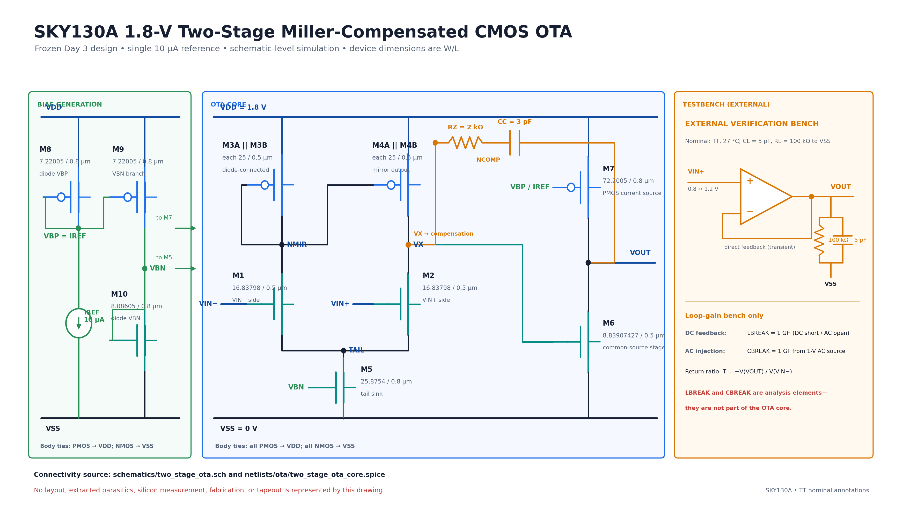
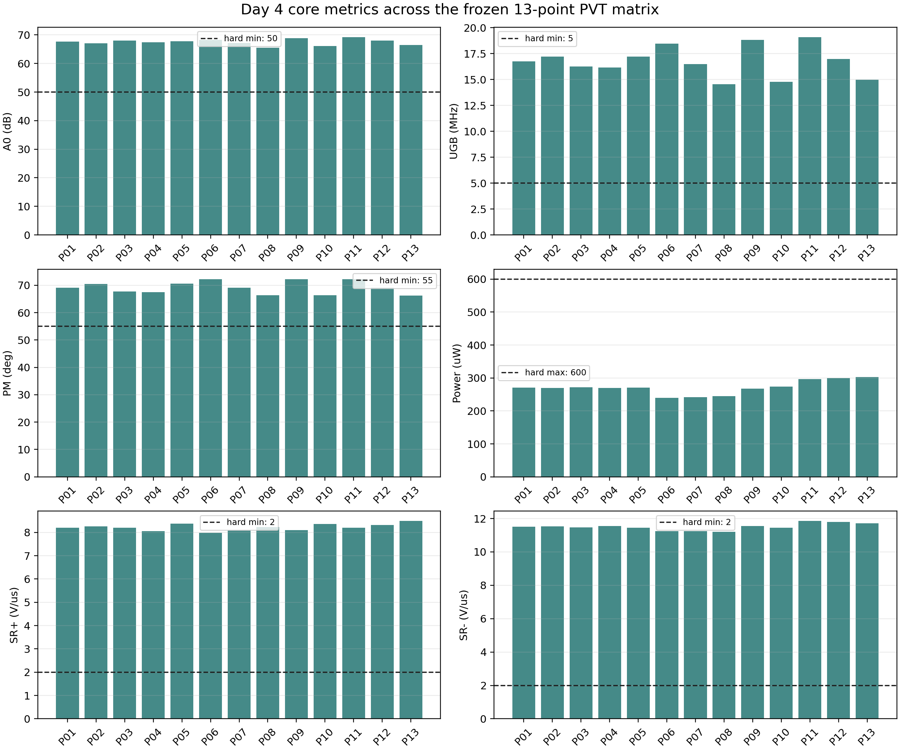
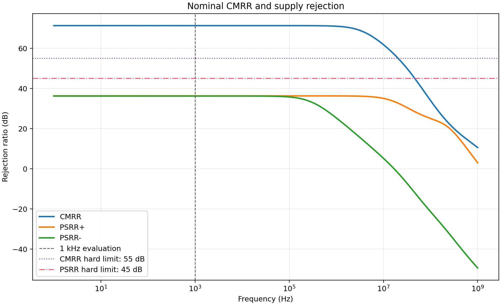
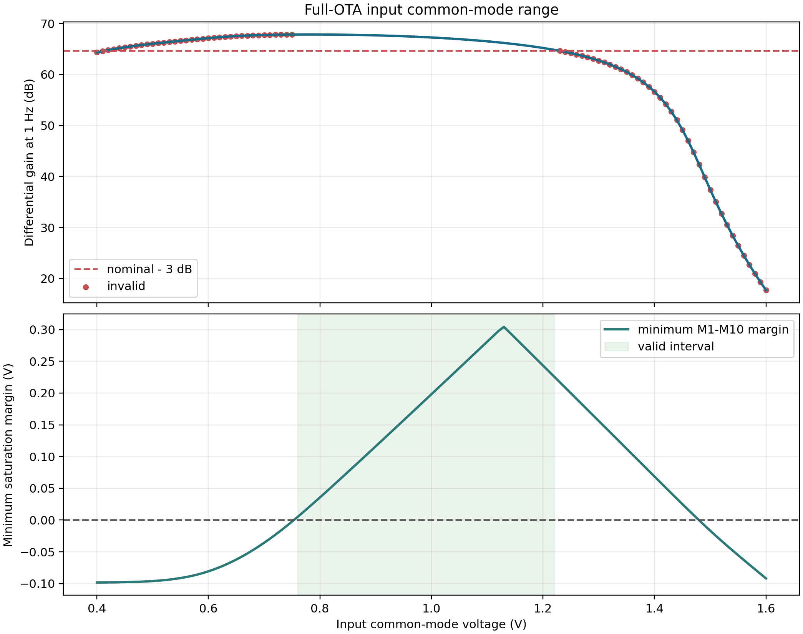
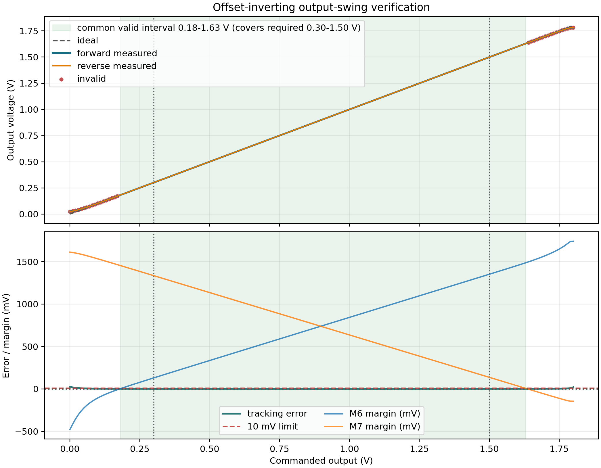
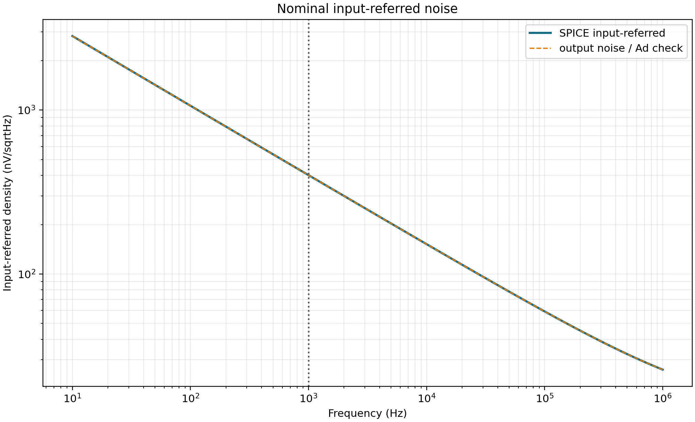
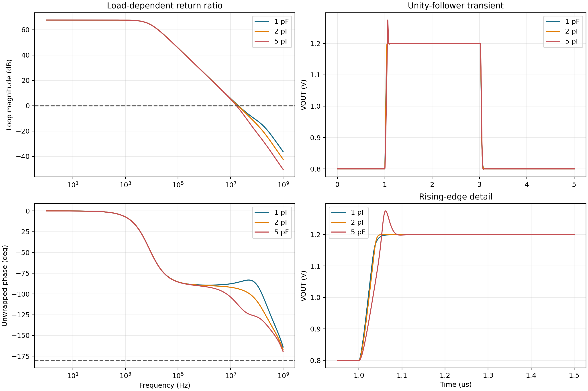

# SKY130 Sensor Readout — Completed Work Checkpoint

As of 2026-09-13, this repository contains completed code, reports, and results for the original two-stage OTA, the V2 calibratable sensor readout core, and Cadence migration and verification. **This is an engineering checkpoint; the complete chip has not passed qualification.**

| Area | Entry point | Current scope |
|---|---|---|
| V2 frontend, ADC, digital control, and partial layout | [V2 overview](v2/README.md) | Retains unfinished stability, sampled-noise, full-code, and top-level parasitic work |
| Latest completed local work | [2026-09-13 record](v2/docs/local_preparation_20260913.md) | Submodule results do not imply system qualification; the latest Cadence reports supersede earlier statements awaiting school results |
| Native Cadence OTA and school-result review | [Cadence status](cadence/project1/README.md) | All 87 entry points have execution evidence; performance failures and review items remain explicit |
| Original OTA design and five-day results | Below and [final report](docs/sky130_two_stage_ota_report.pdf) | Retains schematic-level core PVT success and PSRR/ICMR failures |
| Publication scope and checks | [Checkpoint notes](docs/github_checkpoint_20260913.md) | Large raw waveforms, original school-return packages, and local compiled artifacts remain in the original project |

The original Git history is retained. The current checkout is the English publication edition. Historical measurements and qualification outcomes are not upgraded by translation; [English-edition notes](docs/english_publication_20260913.md) describe filename mappings and artifact integrity.

---

# SKY130 Two-Stage CMOS OTA

Specification-driven design and robustness verification of a 1.8 V, two-stage,
Miller-compensated CMOS operational transconductance amplifier using the
open-source SKY130A PDK.

> **Project status — all five planned days and the final report are complete.**
> The frozen `CC = 3 pF`,
> `RZ = 2 kΩ` design passes all six core requirements at all 13 PVT points.
> Nominal settling, CMRR, output
> swing, and 1/2/5 pF load stability pass. PSRR+ and PSRR- miss their 45 dB
> limits, and the full-OTA ICMR reaches 0.76–1.22 V, so its 1.3 V high-end
> requirement fails. These are schematic-level simulations with an ideal
> external 10 µA reference, not layout-extracted or silicon results.

## Objective

The project converts hand analysis into a reproducible transistor-level design:

`specification -> device characterization -> sizing -> schematic -> simulation -> PVT verification -> documented tradeoff`

The intended core contains:

- an NMOS differential input pair;
- a PMOS current-mirror active load;
- an NMOS tail-current source;
- an NMOS common-source second stage with a PMOS current-source load;
- Miller compensation, with an optional series nulling resistor;
- an external reference-current input and MOS current mirrors for biasing.

## Frozen specification

Nominal conditions are SKY130A TT, 1.8 V, 27 °C, input common-mode voltage of
0.9 V, and an output load of 5 pF in parallel with 100 kΩ. The 100 kΩ load's
connection must be shown explicitly in every applicable testbench.

| Metric | Hard requirement | Stretch target | Qualification scope |
|---|---:|---:|---|
| Open-loop DC gain | >= 50 dB | >= 60 dB | All 13 core PVT points |
| Unity-gain bandwidth | >= 5 MHz | >= 10 MHz | All 13 core PVT points |
| Phase margin | >= 55° | >= 65° | All 13 core PVT points |
| Quiescent power | <= 600 µW | <= 400 µW | All 13 core PVT points |
| Positive slew rate | >= 2 V/µs | >= 4 V/µs | All 13 core PVT points |
| Negative slew rate | >= 2 V/µs | >= 4 V/µs | All 13 core PVT points |
| 1% settling time | <= 1.5 µs | <= 1.0 µs | Nominal |
| CMRR at 1 kHz | >= 55 dB | >= 65 dB | Nominal |
| PSRR+ at 1 kHz | >= 45 dB | >= 55 dB | Nominal |
| PSRR- at 1 kHz | >= 45 dB | >= 55 dB | Nominal |
| Input common-mode range | Includes 0.8–1.3 V | Maximize | Nominal |
| Output swing | Includes 0.3–1.5 V | Maximize | Nominal |
| Input-referred noise | Measure and report | — | Nominal |

Load stability is additionally checked at TT/1.8 V/27 °C with 1 pF, 2 pF,
and 5 pF loads. The hard criterion is phase margin >= 55° at each load and no
sustained oscillation in the corresponding unity-gain transient response.

The authoritative definitions and pass policy are in
[`docs/specification.md`](docs/specification.md). Targets are not results.

## Five-day execution gates

| Day | Work package | State | Exit evidence |
|---|---|---|---|
| 1 | Environment, PDK smoke test, NFET/PFET characterization, current mirror, specification and first calculations | COMPLETE | Verified tool versions; runnable PDK device test; characterization plots/data; current-mirror error/compliance data |
| 2 | Bias network and M1–M5 differential stage | COMPLETE WITH KNOWN BLOCK-LEVEL ICMR FAIL | Device operating-point table; saturation headroom; symmetric input currents; first-stage gain and ICMR sweep |
| 3 | Second stage, Miller compensation, nominal tuning | COMPLETE | Final nominal A0, UGB, PM, power, direct unity transient, and compensation before/after |
| 4 | Full characterization and automated 13-point PVT sweep | COMPLETE WITH DOCUMENTED PSRR/ICMR FAILS | 171 audited runs, populated summaries, failure-preserving PVT table, and final plots |
| 5 | One documented optimization, final report, and repository polish | COMPLETE | 3 pF-only → 3 pF + 2 kΩ formal optimization; 32/32 logs, 48/48 raw TSVs, and 9/9 CSVs audited; geometry variants rejected; six-page report published |

Partial layout and DRC/LVS are optional stretch work only after all schematic-
level exit gates have passed.

## Results

### Final schematic and qualification snapshot

The final four-terminal, explicit-rail schematic is available as the editable
[Xschem source](schematics/two_stage_ota.sch) and as the rendered figure below.
Every NMOS source/bulk and every load/reference return is tied to the documented
`VSS`; PMOS bulks return to `VDD`.



The aggregate machine-readable results are
[`results/summary.csv`](results/summary.csv) and
[`results/pvt_summary.csv`](results/pvt_summary.csv). The complete specification
closure is:

| Metric | Scope | Result used for qualification | Hard target | Status |
|---|---|---:|---:|---|
| Open-loop gain | 13-point PVT | worst 65.5351 dB at P08 | ≥50 dB | PASS |
| Unity-gain bandwidth | 13-point PVT | worst 14.5527 MHz at P08 | ≥5 MHz | PASS |
| Phase margin | 13-point PVT | worst 66.2452° at P13 | ≥55° | PASS |
| Quiescent power | 13-point PVT | worst 302.710 µW at P13 | ≤600 µW | PASS |
| Positive slew rate | 13-point PVT | worst 7.97766 V/µs at P06 | ≥2 V/µs | PASS |
| Negative slew rate | 13-point PVT | worst 11.1958 V/µs at P08 | ≥2 V/µs | PASS |
| 1% settling | nominal | 0.07475 µs | ≤1.5 µs | PASS |
| CMRR at 1 kHz | nominal | 71.3222 dB | ≥55 dB | PASS |
| PSRR+ at 1 kHz | nominal | 36.3313 dB | ≥45 dB | **FAIL** |
| PSRR- at 1 kHz | nominal | 36.2510 dB | ≥45 dB | **FAIL** |
| Input common-mode range | nominal | 0.76–1.22 V | includes 0.8–1.3 V | **FAIL — high end** |
| Output swing | nominal | 0.18–1.63 V | includes 0.3–1.5 V | PASS |
| Input noise density | nominal | 401.170 nV/√Hz at 1 kHz | report | REPORTED |
| Integrated input noise | nominal | 52.3016 µV RMS, 10 Hz–1 MHz | report | REPORTED |
| Load stability, 1 pF | nominal | 94.1626° PM; no sustained/growing oscillation | ≥55° + stable | PASS |
| Load stability, 2 pF | nominal | 86.2882° PM; no sustained/growing oscillation | ≥55° + stable | PASS |
| Load stability, 5 pF | nominal | 69.0829° PM; no sustained/growing oscillation | ≥55° + stable | PASS |

The core PVT rows all pass. The same transient was also characterized for
settling at every corner: P06, P07, and P13 are explicitly
`SETTLING_NOT_REACHED` because at least one direction does not remain inside
the frozen absolute ±4 mV band. Settling is a nominal-only specification and
is not one of the six PVT core gates, so these retained observations do not
change the 13/13 core-PVT result.













### Day 1 evidence

The Day 1 batch run completed at SKY130A TT and 27 °C. Standard-VT 1.8 V NFET
and PFET devices were characterized at `|VDS| = 0.9 V` for channel lengths
0.15, 0.30, 0.50, 0.80, and 1.00 µm. The retained artifacts are:

- [device-characterization plot](results/plots/day1_device_characterization.png)
  and [initial sizing candidates](results/device_sizing_candidates.csv);
- [current-mirror compliance plot](results/plots/day1_current_mirror_compliance.png)
  and [current-mirror summary](results/current_mirror_summary.csv);
- [Day 1 reproducibility manifest](results/day1_reproducibility_manifest.json),
  containing tool/PDK identity, `PASS` log validation, and 45 SHA-256 records;
- raw numeric tables and ngspice logs under `results/raw/day1/`;
- the Xschem-to-ngspice smoke-test netlist and logs under
  `results/smoke/xschem/`.

For the 1:1 NMOS mirror (`W/L = 5/0.8 µm`), the forced reference was 10 µA and
the reference transistor carried 10.0000012 µA at `VOUT = 0.9 V`. The output
current was 10.1780846 µA: 1.78084599% error versus the forced reference, or
1.78083395% versus the measured reference-device current. The model saturation
interval was 0.11–1.80 V; the separately reported interval satisfying
saturation and at most 5% error versus forced `IREF` was 0.28–1.30 V. Interval
endpoints are quantized to the 10 mV sweep grid. These are test-structure
results, not OTA results.

The candidate dimensions derived from the lookup tables are explicitly tagged
`INITIAL_CANDIDATE_NOT_FINAL`. Day 2 checked and revised M1–M5 in the connected
first stage; Day 3 then balanced M6, implemented the complete bias tree, and
verified M1–M10 at the nominal operating point.

### Day 2 first-stage evidence

The selected M1–M5 block uses a 10 µA diode-connected NMOS bias reference and
the following dimensions. M3/M4 are two explicit 25 µm units per side; the
listed 50 µm is each side's total width.

| Group | Selected implementation |
|---|---|
| M1/M2 | each `W/L = 16.83798/0.5 µm` |
| M3/M4 | each side `2 × 25/0.5 µm`, total width 50 µm |
| M5 | `W/L = 25.8754/0.8 µm` |
| MB | `W/L = 8.08605/0.8 µm` |

At TT/1.8 V/27 °C and `VCM = 0.9 V`, the block draws 48.0713851 µA
(86.52849318 µW), with 38.0713829 µA in M5 and 19.0356918 µA in each input
branch. `VBN = 0.658036427 V`, the tail node is 0.214664546 V, and
`VX = 0.792073469 V`. All M1–M5 saturation margins are positive; M5 is the
smallest at 0.1160701611 V. The first-stage-only gain is 36.2697407 dB at 1 Hz
and its 3 dB bandwidth is 45.524514446 MHz.

The formal first-stage-only ICMR criterion combines gain flatness (no more than
3 dB below the 0.9 V reference), nonnegative M1–M5 saturation margins, and an
unpinned `VX`. Its valid contiguous interval is **0.76–1.24 V**. At 1.3 V all
devices remain saturated (minimum margin 0.163156821 V), but gain has changed
by -4.2908617 dB, so 1.3 V is an honest `FAIL`. The looser DC operating-region
diagnostic reaches 1.49 V but is not the formal ICMR result.

The selected channel-area proxy is 94.0071 µm². A legal explicit-parallel
iteration with 179.4248 µm total M3/M4 width per side at `L = 0.8 µm` used
331.0868 µm² and reached only 13.106718 MHz, versus 45.524514446 MHz for the
selected version. The selected compromise reduces that proxy by 71.6065% and
raises bandwidth by 3.473×, at a 1.9359 dB first-stage-gain cost. It also moves
the formal high ICMR boundary from 1.22 V to 1.24 V, though neither version
covers 1.3 V.

Evidence is retained in the [Day 2 summary](results/day2_first_stage_summary.csv),
[operating-point table](results/day2_first_stage_operating_point.csv),
[selected sizing](results/day2_first_stage_sizing.csv),
[gain-based ICMR sweep](results/day2_icmr_gain_sweep.csv), and
[iteration history](results/day2_iteration_summary.csv). Review figures are the
[first-stage AC response](results/plots/day2_first_stage_ac.png) and
[DC/ICMR checks](results/plots/day2_first_stage_dc_icmr.png).

### Day 3 nominal two-stage OTA evidence

The compact nominal implementation keeps the Day 2 M1–M5 dimensions, selects
`M6 = 8.83907427/0.5 µm`, and uses `M7 = 72.2005/0.8 µm`,
`M8 = M9 = 7.22005/0.8 µm`, and `M10 = 8.08605/0.8 µm`. The M6 width comes
from a 6–10 µm balance sweep at `VOUT = 0.9 V`: it interpolates the M6 sink
against the M7 source after subtracting the explicit 9 µA current through the
100 kΩ load to VSS.

The selected compensation is `CC = 3 pF` in series with `RZ = 2 kΩ`. At
TT/1.8 V/27 °C, `VCM = 0.9 V`, and 5 pF || 100 kΩ to VSS:

| Metric | Nominal result | Target status |
|---|---:|---|
| DC follower output | 0.899999206 V | PASS |
| Open-loop gain | 67.6747747 dB | hard + stretch PASS |
| Unity-gain bandwidth | 16.7454480155 MHz | hard + stretch PASS |
| Phase margin | 69.0829107715° | hard + stretch PASS |
| Supply current / quiescent power | 150.298315 µA / 270.536967 µW | hard + stretch PASS |
| Positive / negative slew rate | 8.20202918 / 11.51994781 V/µs | hard + stretch PASS |
| Rising / falling 1% settling | 0.07475 / 0.04075 µs | hard + stretch PASS |
| Minimum M1–M10 saturation margin | 0.1161336635 V | PASS |

The rising transient has 74.99684 mV overshoot; the falling undershoot is
1.858472 mV. SR uses the frozen 20–80% monotonic least-squares definition, with
62 rising and 47 falling fit samples. The overshoot remains reported even
though the waveform subsequently meets the 1% settling criterion. Settling is
timed from the input 50% crossings at 1.01 µs rising and 3.03 µs falling, as
required by the frozen definition.

The loop was genuinely broken for AC while retaining its DC operating point:
a 1 GH inductor closes `VOUT` to `VINN` at DC and opens it for AC, while a 1 GF
coupling capacitor injects a 1 V AC test source into `VINN`. The analyzed return
ratio is `T = -V(VOUT)/V(VINN)`; its 1 Hz phase of -0.00682757215° checks the
sign convention. This is not a bandwidth estimate inferred from a closed-loop
step response.

With 3 pF and effectively zero series resistance, phase margin was only
33.2236432°. Adding 2 kΩ increased it to 69.0829108° (+35.8592675°), while UGB
changed from 17.2553341 to 16.745448 MHz. The explored 3 pF/1 kΩ point is kept
as a failure: 67.6747747 dB gain and 16.3621278 MHz UGB pass, but
52.2886533° phase margin misses the 55° hard limit.

Evidence is retained in the [nominal summary](results/day3_nominal_summary.csv),
[device operating-point table](results/day3_nominal_operating_point.csv),
[final dimensions](results/day3_design_parameters.csv),
[M6 balance sweep](results/day3_m6_balance.csv),
[compensation sweep](results/day3_compensation_comparison.csv), and
[before/after table](results/day3_compensation_before_after.csv). Review the
[M6 balance plot](results/plots/day3_m6_balance.png),
[loop-gain comparison](results/plots/day3_loop_gain_compensation.png), and
[unity-follower transient](results/plots/day3_unity_follower_transient.png).

### Qualification status

Day 4 executed 171 required ngspice decks and retained every row. All logs have
zero exit status and a completion marker: 51 are clean `PASS` and 120 are
`PASS_WITH_DYNAMIC_GMIN`. The analysis release gate also checks finite required
values, exact matrix size, unique non-boundary downward loop crossings, Day 3
nominal correlation, and a single manifest hash. The complete Day 4 evidence
uses manifest
`6b90c7326a881914a362e3b2e6e96e4716b20c8b8196590f22c2ce5e1ab460ab`.

The six core PVT metrics pass at every point, but the design is not an
all-specification pass: both supply-rejection targets and the ICMR high endpoint
fail. The failure rows and raw evidence remain in the aggregate tables rather
than being hidden or replaced with zeroes.

### Day 5 optimization decision

The formal optimization credited to Day 5 is the already validated Day 3
compensation change: adding `RZ = 2 kΩ` to the 3 pF Miller capacitor. Relative
to 3 pF alone, PM rises from 33.2236° to 69.0829° while UGB changes from
17.2553 to 16.7454 MHz. This before/after comparison is backed by the retained
[compensation table](results/day3_compensation_before_after.csv).

The Day 5 `first_stage_l2`, `first_stage_l3`, and `m7_l2` geometry variants are
nominal reconnaissance only. They are not production selections and cannot
replace the Day 4-characterized, core-PVT-qualified baseline without rerunning
the full 13-point PVT, 121-point ICMR, bidirectional output swing, rejection,
noise, and load campaign.
The current decision is therefore **keep the frozen Day 4 baseline**;
`first_stage_l2` is specifically rejected despite improving PSRR+/- to
72.419/67.315 dB: PM falls by 7.559° to 61.524°, while the Day 4-equivalent
1 Hz ICMR gain delta at 1.3 V worsens from -4.935 dB to -7.361 dB
(-2.425 dB). The total channel-area proxy grows to 2.195× baseline, and no PVT
requalification was run. `first_stage_l3` and `m7_l2` regress the nominal hard
PM limit. The bounded campaign completed 32/32 audited logs, 48/48 raw TSV
contracts, and 9/9 result CSV checks under manifest
`89f886ce2a150b84945a5378f29c2d4ee3faa5ef832876aeb122deb05e01391e`.
See the [Day 5 experiment record](experiments/day5/README.md),
[decision summary](experiments/day5/decision_summary.csv), and
[reconnaissance table](experiments/day5/recon_summary.csv).

## Repository map

```text
sky130-two-stage-ota/
├── README.md
├── LICENSE
├── environment/
│   ├── setup_notes.md
│   └── tool_versions.txt
├── netlists/
│   ├── day1/                 # device and mirror characterization
│   ├── day2/                 # connected first-stage characterization
│   ├── day3/                 # second-stage, loop, compensation, transient
│   ├── day4/                 # PVT and nominal characterization templates
│   └── ota/                  # shared final OTA core
├── scripts/
│   ├── run_day1.sh ... run_day4.sh
│   ├── render_day*.py / analyze_day*.py
│   ├── check_final_schematic.py
│   ├── build_report.py
│   ├── run_all.sh
│   └── start_eda_desktop.sh
├── experiments/
│   └── day5/                 # isolated nominal reconnaissance and decision
├── docs/
│   ├── specification.md
│   ├── design_calculations.md
│   ├── architecture.md
│   ├── project_log.md
│   ├── design_log.md
│   ├── results.md
│   ├── status.md
│   ├── career_materials.md
│   └── sky130_two_stage_ota_report.pdf
├── schematics/
│   ├── two_stage_ota.sch
│   └── README.md
└── results/
    ├── summary.csv
    ├── pvt_summary.csv
    ├── day1_*, day2_*, day3_*, day4_*
    ├── plots/                 # schematic and review figures
    ├── raw/day1/ ... raw/day4/
    └── smoke/xschem/
```

## Reproduction

With Docker available and Colima running, reproduce all five stages and verify
the final schematic with one command from the repository root:

```sh
./scripts/run_all.sh
```

The orchestrator runs Day 1 through Day 4 in order, runs the isolated Day 5
reconnaissance, and executes the schematic checker. Individual stages remain
available as `./scripts/run_day1.sh`, `./scripts/run_day2.sh`,
`./scripts/run_day3.sh`, `./scripts/run_day4.sh`, and
`./experiments/day5/run.sh`. The runs use the project-pinned IIC-OSIC Docker
image and SKY130A revision recorded in the manifests. Exact setup details are
in [`environment/setup_notes.md`](environment/setup_notes.md).

The finished six-page portfolio report is
[`docs/sky130_two_stage_ota_report.pdf`](docs/sky130_two_stage_ota_report.pdf),
and truthful resume bullets, a 90-second project pitch, and interview prompts
are in [`docs/career_materials.md`](docs/career_materials.md).

To rebuild the PDF after rerunning the simulations:

```sh
python3 -m pip install -r environment/report-requirements.txt
./scripts/build_report.py
```

## Limitations and claims

This is a simulation-based educational IC-design project using an open-source
PDK. Day 4 establishes schematic-level corner results for the specified global
process/voltage/temperature matrix; it does not establish production readiness.

- Process corners do not model local device mismatch.
- The external `IREF = 10 µA` source is ideal; reference-generator variation,
  startup, and supply sensitivity are not modeled.
- No Monte Carlo run means no mismatch, offset-distribution, yield, or input-
  offset distribution claim.
- No physical layout, DRC/LVS result, extracted parasitics, or post-layout
  simulation is included.
- The circuit has not been fabricated, packaged, or measured in silicon.
- Day 5 geometry variants are nominal reconnaissance, not PVT-qualified
  replacements for the frozen baseline.
- PSRR± and the ICMR high endpoint are documented failures, not passes.
- Dynamic-gmin use and the noise-model conductance-reset warnings remain
  visible in the Day 4 log audit.
- No result may be described as measured; the correct term is simulated.
- No production-qualified, tapeout-ready, or silicon-validated claim is made.

## License

Project-authored material is released under the MIT License. SKY130 PDK files,
models, and third-party EDA tools retain their own licenses and are not
redistributed by this repository.
