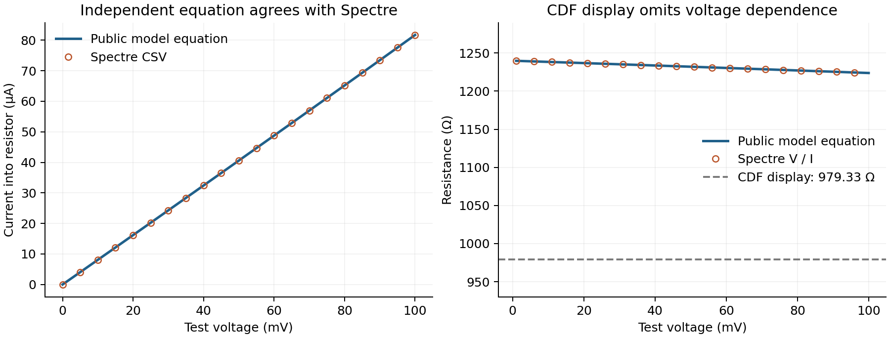

# 工艺电阻 DC 复核：实际结果与模型一致，原比较规则不适用

本次运行 `res_dc/20260912T092706Z_31ca6c32` 已完成原生网表导出、连接与参数核对、Spectre 仿真和波形导出。复算表明，返回的整条 I–V 曲线与公开 SKY130 电阻模型公式一致。原 `PASS FAIL` 中的第二个 `FAIL` 来自本包设置不适用的 CDF 数值／线性门槛；原报告和状态文件保持原样。

## 证据与范围

- 工艺器件：`res_high_po_0p35`；W=L=0.35 µm，第三端与负端均接 VSS。
- 条件：TT，温度与 tnom 均为 27°C；电压 0～0.1 V、步长 1 mV。
- Spectre：21.1.0.132.isr1；正常结束，0 errors、0 warnings、4 notices。
- 电压和电流 CSV 均为 101 点，扫描轴逐点一致；电压等于设定刺激，DC 虚部为零。
- 返回清单与已交付 1.0.4p1 清单哈希一致；正式输入、原生网表和 OCEAN 顶层输入哈希均已核对。

复核细节见 [review.json](review.json)，逐点复算见 [resistor_recalculated.csv](resistor_recalculated.csv)。复算程序为 [review_resistor.py](review_resistor.py)，它只读取收到的结果，另写复核文件，不修改原始状态。

## 差异来源

[官方公开模型](https://raw.githubusercontent.com/google/skywater-pdk-libs-sky130_fd_pr/main/cells/res_high_po/sky130_fd_pr__res_high_po_0p35.model.spice)把这个器件表示为接触电阻、本体电阻和寄生电容组成的子电路，电阻公式包含电压修正项。文档也说明了[精密多晶硅电阻的子电路及接触／本体结构](https://foss-eda-tools.googlesource.com/skywater-pdk/+/5a57f505cd4cd65d10e9f37dd2d259a526bc9bf7/docs/rules/device-details/res_high/index.rst)。来源检索日期为 2026-09-12。

公开模型中，未加电压修正的接触与本体电阻之和为：

`589.99 + 0.35 × 1112.41 = 979.3335 Ω`

这个值与 CDF 显示的 979.33 Ω 一致。但本次低电压扫描需代入接触、本体的电压修正项，实际端口等效电阻因此位于约 1.22～1.24 kΩ。这里没有对返回曲线拟合任何模型系数。

| 电压 | Spectre 导出电流的幅值 | 导出的 V/I | 公开模型公式复算 |
|---|---:|---:|---:|
| 0.010 V | 8.075425 µA | 1238.324865 Ω | 1238.324865 Ω |
| 0.050 V | 40.584573 µA | 1231.995233 Ω | 1231.995233 Ω |
| 0.100 V | 81.715817 µA | 1223.753294 Ω | 1223.753294 Ω |

全部 100 个非零电压点的最大电流相对差异为 `4.44×10⁻¹⁶`，属于浮点舍入量级；零电压点电流也一致为零。原脚本得到的平均阻值 1231.136636 Ω、相对 CDF 高 25.7121%、区间阻值变化 1.18359% 均被独立复算重现。



因此，正确的此项环境验证应将 I–V 与相同条件下的模型公式对照。不能把 CDF 的简化显示值当作固定的端口直流电阻，也不应给这个模型强加与自身电压特性冲突的 1% 线性要求。这是原测试判据的设计问题。

本复核的数值一致性检查采用 `|I−Iref| ≤ 1 pA + 0.01%×|Iref|`，对应执行输入中电流绝对容差和相对容差的各 10 倍；不是把原 CDF 阈值放宽到覆盖观测差异。模型系数取自公开源文件，未按实测值校准。

## 日志与未完成项

Spectre 的提示包括内部电容两端同接 VSS、全局地只有一个连接以及扫描结束恢复设计变量。前两项与这份电路的连接方式一致；没有模型加载错误或收敛警告。OCEAN 日志另有字体、日志锁和库重定义等警告，网表及数据导出均实际完成；这些警告仍保留在原日志中。

本次结论仅为该器件、该几何、TT/27°C、0～0.1 V 条件下的 DC 模型响应一致。没有获取学校模型依赖文件的完整内容，未声明它们与公开版本逐文件哈希相同；原始二进制 PSF 已保留，本复核使用 OCEAN 导出 CSV，没有另行独立解码 PSF。

这不构成 MIM、RC、OTA、PVT、噪声、版图或完整系统通过。原测试文件中的 `performance_status=FAIL` 保留；本目录的模型复核结论单独记录为 `PASS_DC_MODEL_COMPARISON_AT_REPORTED_CONDITION`。原运行器的阶段门槛尚未更改。

## 下一步：用现有包采集 MIM 和 RC 结果

在学校 Linux 的 `basic_design_v1_0_4` 文件夹、已经配置好 Cadence 环境的终端中，依次执行：

```bash
bash p1_run.sh run --job mim_ac --retry
bash p1_run.sh run --job rc_step --retry
bash p1_run.sh collect
```

这两个基础测试可独立运行，不会把原电阻失败状态改成通过，也不进入 OTA 阶段。即使其中一项显示性能 `FAIL`，保留并回传结果；如果出现工具启动或网表错误，回传完整错误信息。

RC 的现有比较值仍是 `979.33 Ω × 34.6223 fF`，未计入此次确认的电阻电压依赖和工艺模型的电容寄生，适用性也需要复核。等 MIM 与 RC 原始结果齐全后，统一更新被动件分析与运行门槛，避免逐项修改标准、反复上传小补丁。
