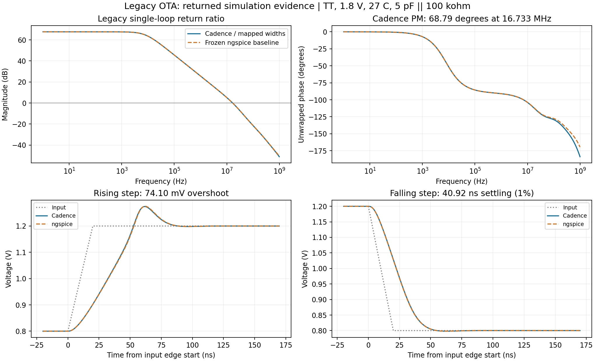

# Legacy two-stage OTA: nominal reproduction passed

Report: `project1_basic_report_20260913T015701Z_582c6ec8.zip`  
Report SHA256: `1145038acb946f06e97a5995308f9316bdc49217f6674bbf2f41e11436ec9eb4`  
Runtime package: 1.0.4p3; package-manifest SHA256: `a77492fe2de2aee32ab9021c867bfb1b38a66ed6e5826b4c9e3a51211585336e`

Local review checked the original report, source manifest, native-exported netlists, actual executed inputs, device operating points, complete CSVs, simulation logs, and frozen old results. All four nominal jobs pass the original Day 4 criteria. This review did not start local Cadence or change the upload package, circuit, or acceptance thresholds.

## What was actually measured

Conditions: TT, 1.8 V, 27°C, with a 5 pF parallel 100 kΩ output load. Input common mode for operating-point, AC, and loop tests is 0.9 V; the step input is 0.8→1.2→0.8 V with 20 ns edges.

| Test | Validation purpose | Cadence result | Frozen ngspice result | Legacy threshold |
|---|---|---:|---:|---:|
| Operating point | Bias and static supply power | 271.8276 µW | 270.5370 µW | ≤600 µW |
| AC | Low-frequency differential gain | 67.6836 dB | 67.6760 dB | ≥50 dB |
| Loop | Unity-gain frequency | 16.7329 MHz | 16.7454 MHz | ≥5 MHz |
| Loop | Phase margin | 68.7881° | 69.0829° | ≥55° |
| Step | Rising slew rate | 8.2935 V/µs | 8.2020 V/µs | ≥2 V/µs |
| Step | Falling slew rate | 11.4567 V/µs | 11.5199 V/µs | ≥2 V/µs |
| Step | Worst 1% settling time | 74.1862 ns | 74.7500 ns | ≤1500 ns |

Nominal static output voltage is 0.900012 V. All 13 MOS devices exported finite ids, gm, gds, vds, and vdsat and passed the existing saturation criteria; at 0.9 V common mode, the minimum saturation margin is M5's 116.19 mV. The step test begins with 0.8 V input, where M5's initial margin is only 35.67 mV; this does not prove that every device remains saturated throughout the transient.

Each of the two frequency-domain records has 1081 points fully covering 1 Hz–1 GHz; the loop has only one downward 0 dB crossing and the correct low-frequency sign. The step record has 10116 points covering 0–5 µs with time spacing no greater than 0.5 ns. All metrics were recalculated from CSV and checked against school-generated metrics.json.

Rising-edge overshoot is **74.096 mV**, about **18.52%** of the 0.4 V step; overshoot in the frozen old waveform is **74.997 mV**. This is an existing response feature of the original design and is retained in the record. Legacy criteria do not impose a separate overshoot limit. “1% settling” means entering and remaining within target ±4 mV; it cannot serve as the new ADC's 0.25 LSB settling acceptance.



## Did the previous fix work?

Yes. `P01_op RESUMED_EXPORT` used the original PSF that had already converged, successfully read the 13 actual MOS devices inside wrapper subcircuits, completed operating-point export, and reevaluated it. Recovery records and original PSF hashes were checked; the prior failure is fully preserved.

`P01_op ALREADY_ATTEMPTED` means the subsequent nominal batch skipped the just-recovered successful operating-point job, which is normal continuation. AC, loop, and step were newly executed Spectre simulations at the school in this run.

The patch only fixed result reading and error handling; it did not adjust MOS dimensions, bias, or compensation. Earlier school-CDF width rounding and the M7 split remain in the frozen dimension mapping. Small differences from ngspice are recorded as migration differences; contributions from models, dimension mapping, and solvers have not yet been isolated individually.

## Logs and applicability

All four Spectre jobs terminated normally, completing DC solutions in 11, 16, 16, and 13 iterations respectively, each with 0 errors and 0 warnings, plus 3, 4, 4, and 3 notices. `Bad pivoting` numerical-solver notices are retained; solver options were not changed to remove them.

OCEAN startup still records old-host log locks, duplicate library definitions, font messages, and debugger notices; exports are complete this time with no device OP read errors. OCEAN did not separately save numeric exit-code files; local conclusions rely on returned statuses, export-completion markers, logs, and data completeness without inventing additional exit-code evidence.

The conclusion is limited to nominal reproduction of the legacy OTA. Process resistor, MIM, and RC reviews passed at default dimensions under TT/27°C. The OTA's 2 kΩ compensation resistor and 3 pF capacitor remain ideal components under the frozen baseline; independent process-passive success does not mean compensation components inside the OTA were replaced. PVT, extra loads/common-mode/noise, the new frontend, ADC, and post-layout simulation remain subsequent work.

## Next step: run the existing PVT group directly

**Execution location: school Linux terminal. No file upload or repeated CIW load is required this time.**

Copy and execute the complete line:

```bash
bash ~/cadence_skywater/p1_school_run_v1.sh run --group pvt
```

This command serially runs operating-point, AC, loop, and step tests for P02–P13, totaling 48 jobs. Together with completed P01, this is the originally planned 13-point core PVT, not the 45-condition full combination required for the new frontend.

| Condition | Process corner | Supply | Temperature |
|---|---|---|---|
| P01 (completed) | TT | 1.8 V | 27°C |
| P02–P05 | FF / SS / FS / SF | 1.8 V | 27°C |
| P06–P08 | TT | 1.62 V | −20 / 27 / 85°C |
| P09–P10 | TT | 1.8 V | −20 / 85°C |
| P11–P13 | TT | 1.98 V | −20 / 27 / 85°C |

It tests whether the same circuit still meets legacy requirements as manufacturing speed, supply, and temperature vary; it does not modify the circuit. PVT `PASS FAIL` results are retained while other conditions continue; tool, export, or data errors stop execution. Do not add `--retry` this time, to avoid rerunning existing attempts.

After the command finishes, or an error returns to the terminal prompt, run:

```bash
bash ~/cadence_skywater/p1_school_run_v1.sh collect
```

Download the new report ZIP at the final printed path and return it to this task. If execution stops early, do not blindly retry; preserve and return the report first. Then compare every passing/failing point with old PVT before scheduling the existing extra-test group.

## English technical summary

The mapped legacy two-stage OTA passes the frozen Day 4 nominal acceptance criteria at TT, 1.8 V and 27°C with a 5 pF || 100 kΩ load. Returned native netlists, executed decks, device operating points, complete CSV records and Spectre logs were reviewed. Measured gain is 67.6836 dB, loop unity frequency 16.7329 MHz, phase margin 68.7881°, static supply power 271.8276 µW, and worst 1% settling time 74.1862 ns. All 13 MOS operating-point records are complete. Rising-step overshoot is 74.096 mV versus 74.997 mV in the frozen ngspice waveform. The OP export was recovered from retained PSF without another Spectre run; AC, loop and transient were newly executed at the school. All four Spectre results report zero errors and warnings, with retained bad-pivot notices. Qualification does not extend to PVT, the newer frontend/ADC, process-passive replacement inside the OTA, or physical implementation.
