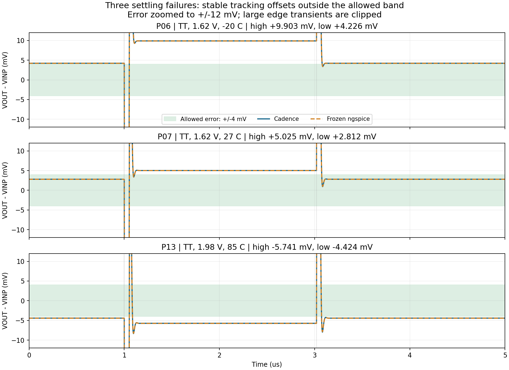

# Legacy OTA: 13-point PVT review and next steps

**Execution is complete; performance did not pass everywhere.** All 48 new jobs terminated normally, with 45 passes and 3 failures. Including previous nominal conditions gives 49 passes and 3 failures among 52 jobs. Requiring all four tests per condition gives 10 passes among 13 conditions; P06, P07, and P13 fail step settling.

Report: `project1_basic_report_20260913T023544Z_5cc09eef.zip`  
Report SHA256: `9730a427a344b5161dc5faf99dd3c573ed76f68c86a9de8893601e1079c6a3d3`  
Runtime package: 1.0.4p3; package-manifest SHA256: `a77492fe2de2aee32ab9021c867bfb1b38a66ed6e5826b4c9e3a51211585336e`.

## Why three tests failed

The input pulse switches between 0.8 V and 1.2 V, a 0.4 V step. The original 1% settling requirement is that output enters target ±4 mV within the specified time and remains there. All three waveforms have stabilized, but their final outputs differ from target; settling times are therefore recorded as missing and performance is FAIL.

| Condition | Process/supply/temperature | High-level error | Low-level error | Failing edges |
|---|---|---:|---:|---|
| P06 | TT/1.62 V/-20°C | +9.903 mV | +4.226 mV | Rising, falling |
| P07 | TT/1.62 V/27°C | +5.025 mV | +2.812 mV | Rising |
| P13 | TT/1.98 V/85°C | -5.741 mV | -4.424 mV | Rising, falling |

For example, P06 targets a high level of 1.200 V but settles at 1.209903 V, 9.903 mV high; its target low level is 0.800 V but it settles at 0.804226 V, 4.226 mV high. Both exceed ±4 mV. Late-time data are already almost constant, so existing evidence does not support resolving this by an unchanged rerun or simply extending the duration.



The green region is the allowed error band. Blue is Cadence and dashed orange is frozen ngspice; they almost coincide at steady state. The vertical axis is enlarged to ±12 mV, clipping large switching-instant errors; complete waveforms remain in the original report.

## The old results actually have the same issue

| Condition | Old high-level error | New high-level error | Old low-level error | New low-level error |
|---|---:|---:|---:|---:|
| P06 | +9.888 mV | +9.903 mV | +4.214 mV | +4.226 mV |
| P07 | +5.008 mV | +5.025 mV | +2.799 mV | +2.812 mV |
| P13 | -5.762 mV | -5.741 mV | -4.437 mV | -4.424 mV |

Frozen `reference/pvt_summary.csv` records both `pass_fail=PASS` and `settling_status=SETTLING_NOT_REACHED` on these three rows, with blank settling times. The PVT aggregate decision in the project's existing `scripts/analyze_day4.py` checks gain, bandwidth, phase margin, power, slew rate, and other metrics but does not include settling time. Therefore, this historical PASS cannot mean that all four test categories required here passed.

All 13 frozen transient waveforms were recalculated using the current consistent settling-measurement method; old data fail at the same three conditions. Original CSVs, historical labels, and reports remain unchanged; reviewed decisions appear separately in `pvt_comparison.csv`. `historical_pass_fail` is only the old label, not the basis for current acceptance.

## Complete 13-condition summary

All loads are 5 pF parallel 100 kΩ. Table power is from the OP test at 0.9 V common mode; the step's initial common mode is 0.8 V, so its initial power differs slightly.

| Condition | Process | VDD | Temperature | Gain dB | Loop MHz | PM ° | Power µW | Worst settling ns | Result |
|---|---|---:|---:|---:|---:|---:|---:|---:|---|
| P01 | TT | 1.80 | 27 | 67.684 | 16.733 | 68.788 | 271.828 | 74.19 | PASS |
| P02 | FF | 1.80 | 27 | 67.114 | 17.212 | 70.239 | 270.782 | 71.66 | PASS |
| P03 | SS | 1.80 | 27 | 68.032 | 16.218 | 67.329 | 272.755 | 76.34 | PASS |
| P04 | FS | 1.80 | 27 | 67.452 | 16.153 | 67.182 | 271.627 | 76.07 | PASS |
| P05 | SF | 1.80 | 27 | 67.844 | 17.176 | 70.215 | 271.825 | 71.65 | PASS |
| P06 | TT | 1.62 | -20 | 68.326 | 18.451 | 71.964 | 240.634 | Not reached | FAIL |
| P07 | TT | 1.62 | 27 | 67.141 | 16.457 | 68.847 | 242.922 | Not reached | FAIL |
| P08 | TT | 1.62 | 85 | 65.540 | 14.536 | 66.077 | 245.525 | 78.97 | PASS |
| P09 | TT | 1.80 | -20 | 68.853 | 18.798 | 71.937 | 269.315 | 74.96 | PASS |
| P10 | TT | 1.80 | 85 | 66.112 | 14.758 | 65.993 | 274.718 | 99.26 | PASS |
| P11 | TT | 1.98 | -20 | 69.216 | 19.072 | 71.936 | 298.101 | 70.73 | PASS |
| P12 | TT | 1.98 | 27 | 68.059 | 16.955 | 68.758 | 300.830 | 95.77 | PASS |
| P13 | TT | 1.98 | 85 | 66.507 | 14.939 | 65.939 | 303.995 | Not reached | FAIL |

OP, AC, and legacy single-loop tests pass under every condition; rising/falling slew rates pass. Minimum differential gain is 65.54 dB, minimum loop unity-gain frequency 14.536 MHz, minimum phase margin 65.94°, and maximum OP supply power 304.00 µW. The qualified scope remains legacy OTA metrics, not new-frontend or ADC metrics.

## Local checks and limitations

- Extracted report files were checked individually against the ZIP; all 272 run files from the previous report remain unchanged.
- Reconstructed 1.0.4p3 from versioned local sources and checked its manifest; all 52 jobs' native-exported netlists, parameters, port connections, and actual inputs were rechecked. Every job has the same OTA core netlist and model-entry hash.
- All 52 jobs' CSVs were reanalyzed and agree with school metrics.json, allowing only cross-platform floating-point rounding. No circuit changes or relaxed metrics were used.
- All 26 AC/loop records have 1081 points spanning 1 Hz–1 GHz; all 13 transient records fully span 0–5 µs with maximum step ≤0.5 ns. Each job has complete finite operating-point records for 13 MOS devices.
- All 48 new Spectre jobs have 0 errors and 0 warnings; 24 have 3 notices and 24 have 4 notices. Numerical-solver notices are retained accurately.
- P01 OP is an export recovery from previous PSF; the remaining PVT jobs actually ran at the school. Cadence was not executed locally, and school model dependencies, licenses, or the OA database cannot be verified locally. OCEAN numeric exit codes were not separately archived; export is checked through returned statuses, logs, completion markers, and actual data.
- Device-level causes of steady errors have not been decomposed. Existing evidence shows the same issue as in the old design but does not justify attributing all differences to one device, width rounding, or solver.
- No process-compensation replacement, mismatch, dynamic-noise, layout, or full-system acceptance was performed.

## Next step: complete the existing extra tests

Continue the existing legacy OTA basic-test scope to complete performance records. Preserve the three failures; no circuit regeneration or new patch is needed.

**Execution location: school Linux terminal.** Copy the complete line:

```bash
bash ~/cadence_skywater/p1_school_run_v1.sh run --group extra
```

This group contains 32 tests, covering common-mode response, supply-perturbation response, ordinary small-signal noise, DC follower range, loop and step tests at four additional loads (1/2/10/20 pF), and 19 input common-mode operating points. They record legacy OTA applicability; ordinary noise testing is not ADC switching dynamic-noise testing.

`PASS REVIEW_REQUIRED` means simulation and export completed, but the item lacks an automatic numeric acceptance gate or requires analysis with other data; it is not performance PASS. Exported common-mode/supply transfer responses cannot directly be called CMRR/PSRR; later conversion requires differential gain at the same frequency. Real performance failures may occur near input common-mode limits; retain them and continue. Tool, netlist, or export errors stop the program.

After the command finishes or stops, run:

```bash
bash ~/cadence_skywater/p1_school_run_v1.sh collect
```

Download and return the ZIP at the final printed path. Do not add `--retry`, execute `create.il`, or modify the original baseline this time. Discuss design revisions for actual deficiencies after reproduction records are complete; the three PVT failures still prevent a claim that the legacy OTA meets all metrics.

## English technical summary

All 48 additional PVT simulations completed normally with zero Spectre errors and warnings. Together with the retained nominal results, 49 of 52 jobs pass the current legacy acceptance criteria; P06_step, P07_step and P13_step fail 1% settling because their settled output errors exceed ±4 mV. Reanalysis of frozen ngspice waveforms reproduces the same failures. The historical aggregate PASS label does not include settling in its decision and must not be used as full qualification. All 13 conditions pass OP, differential AC and legacy single-loop criteria. The original netlists, results and historical labels are preserved. Further characterization may proceed with the existing extra group; full PVT performance qualification remains failed.
