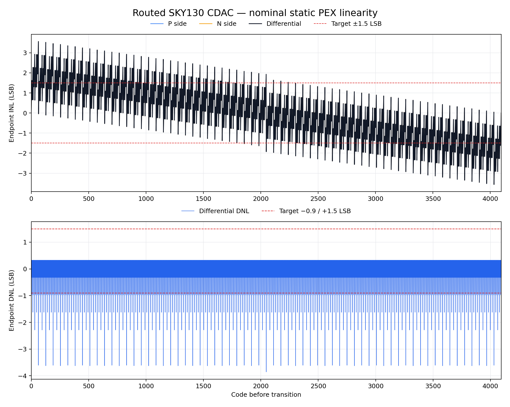
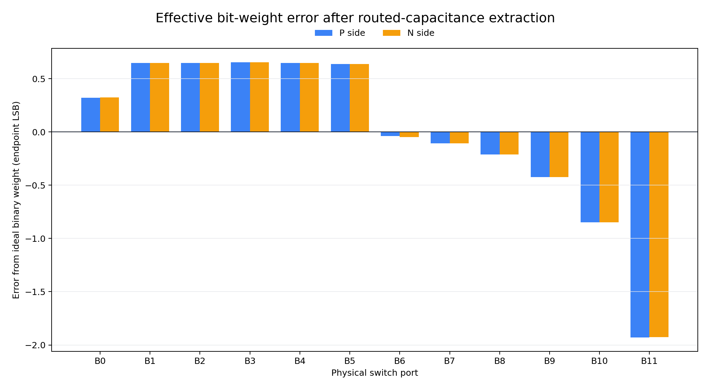

# CDAC 寄生提取后静态线性核验（2026-09-11）

## 一句话结论

我们已经把最终差分 CDAC 版图提取出来的真实电容网络用于全部 **4096 个码**的静态电荷重分配计算。计算方法和输入都有效，但当前版图的线性结果**没有通过**：

- 差分端点法 INL：`−3.5621 ～ +3.5621 LSB`，目标是 `±1.5 LSB`；
- 差分端点法 DNL：`−3.8545 ～ +0.3243 LSB`，目标是 `−0.9 ～ +1.5 LSB`；
- 有 **255 个相邻码转换发生反向跳变**，因此单调性和“无缺码必要条件”均失败；
- 最差反向跳变出现在 `2047 → 2048`；
- P、N 两边经过端点归一化后的最大差异只有 `0.01057 LSB`。这说明左右镜像做得很好，但两边共同复制了相同的系统性寄生误差，差分相减无法消掉它。

机器可读结论见 [`qualification.json`](qualification.json)，状态为：

`CDAC_PEX_STATIC_LINEARITY_FAIL_NONMONOTONIC`

这不是“仿真程序失败”。恰恰相反，分析完整执行并通过了输入、连通性、矩阵和文件哈希核验；失败的是**当前物理电容权重本身**。

## 你刚才看到的那张图是什么

那张黑底图不是晶体管原理图，也不是完整芯片。它是 SAR ADC 里面的一个无源模块——**差分电容 DAC（CDAC）的版图**：

- 左边大矩形是 P 侧电容阵列；
- 右边大矩形是 N 侧电容阵列；
- 每一个小方格是一只真实 SKY130 MIM 电容；
- 密集的彩色线条是把电容接到 `TOP`、`B11…B0`、`DUMMY` 和 `EDGE_BIAS` 的金属与过孔；
- 两边合计有 8,712 只物理 MIM，其中 8,192 只是有效电容，520 只是边缘保护 dummy；
- 这张版图已经做到开源流程 DRC=0、LVS 唯一匹配和 RC 提取，但这不自动等于模拟性能合格。

没有文字遮挡的原始版图展示图在：

- [`../../../physical/cdac_route_20260911/artifacts/cdac_diff_routed_display_no_labels.png`](../../../physical/cdac_route_20260911/artifacts/cdac_diff_routed_display_no_labels.png)
- [`../../../physical/cdac_route_20260911/artifacts/cdac_routing_detail_display_no_labels.png`](../../../physical/cdac_route_20260911/artifacts/cdac_routing_detail_display_no_labels.png)

这些 PNG 只在展示副本中隐藏了文字，GDS 和电气连接没有被修改。

## 为什么“DRC/LVS 通过”后仍会线性失败

可以把 CDAC 想成一架十二档砝码天平：

- B0 理应是 1 份；
- B1 理应是 2 份；
- B2 理应是 4 份；
- ……；
- B11 理应是 2048 份。

DRC 只检查几何是否违反制造规则；LVS 只检查“该接的有没有接、器件数量和网络是否一致”。它们不会保证金属导线自己带来的寄生电容仍严格保持 `1:2:4:…:2048`。

当前结果里，低位网络获得了相对更大的附加 TOP 耦合。例如 P 侧：

| 端口 | 有效 TOP 耦合 |
|---|---:|
| B0 | 27.89023 fF |
| B1 | 55.94460 fF |
| B2 | 98.23780 fF |
| B3 | 182.90650 fF |
| B4 | 351.84180 fF |

当码从 `...01111` 进位成 `...10000` 时，B3…B0 被同时撤掉、B4 被接入。当前 B4 的增加量不足以抵消四个低位的总撤除量，所以输出反而后退。这个模式每 16 个码重复一次，共形成 255 次反向跳变。

## 我们怎样从 PEX 得到结果

最终输入是已冻结、未修改的三个 RC PEX 网表：

- 差分顶层：[`../../../physical/cdac_route_20260911/artifacts/cdac_diff_routed_flat_rc.spice`](../../../physical/cdac_route_20260911/artifacts/cdac_diff_routed_flat_rc.spice)
- P 侧：[`../../../physical/cdac_route_20260911/artifacts/cdac_side_p_routed_flat.rc.spice`](../../../physical/cdac_route_20260911/artifacts/cdac_side_p_routed_flat.rc.spice)
- N 侧：[`../../../physical/cdac_route_20260911/artifacts/cdac_side_n_routed_flat.rc.spice`](../../../physical/cdac_route_20260911/artifacts/cdac_side_n_routed_flat.rc.spice)

分析步骤如下：

1. 读取差分顶层的 30 个真实端口：P、N 各自的 `TOP`、`B11…B0`、`DUMMY` 和 `EDGE_BIAS`。
2. 审计 26,210 段提取电阻，确认每一个内部金属节点最终只连到一个正确端口，没有浮空岛，也没有两个端口被错误短接。
3. 在“等待无限久”的静态极限下，把同一网络内的有限电阻收缩成理想导线。电阻会影响有限时间建立速度，但不会改变最终静态电容比。
4. 读取全部提取电容。网表实际包含 17,710 个 `f` 后缀正值、20 个 `p` 后缀正值和 2 个显式零值；本分析没有漏掉 `p` 后缀。
5. 每只 3 µm × 3 µm MIM 的本征电容采用本项目先前用同一 SKY130 环境实测并冻结的标称值 `19.845 fF`；再叠加金属提取电容。
6. 由 TOP 电荷守恒计算：

   `ΔV_TOP = Σ(C_TOP,j × ΔV_j) / ΣC_TOP,j`

7. P 侧使用当前码，N 侧使用 12 位反码；`DUMMY` 和 `EDGE_BIAS` 固定不切换。
8. 对 0…4095 全部码计算输出，再按端点法计算 INL、DNL、单调性和无缺码必要条件。

独立 P/N 网表和差分顶层网表中的全部 12 个码驱动 TOP 耦合逐项完全一致；顶层只增加了约 `0.0003/0.0004 fF` 的额外固定 TOP 电容。这项交叉检查防止只相信某一个文件。

## 结果图（文字与曲线分区，没有压线标注）

图例放在绘图区外，图中没有把数字文字贴在曲线上。



下面这张图把每一位相对理想二进制权重的误差单独展开。P、N 两组柱子几乎重合，说明主要问题是共同的布线寄生，不是左右失配。



## 可审计文件

- [`results/all_4096_codes.csv`](results/all_4096_codes.csv)：每个码的 P 输出、N 反码输出、差分输出、INL 和到下一码的 DNL。
- [`results/bit_weights.csv`](results/bit_weights.csv)：B0…B11 的本征 MIM、电路提取附加量、有效总量和权重误差。
- [`results/capacitance_pairs.csv`](results/capacitance_pairs.csv)：每一对真实端口之间的电容来源和总量。
- [`results/port_capacitance_matrix_fF.csv`](results/port_capacitance_matrix_fF.csv)：31 × 31 对称“端口对电容”矩阵，包含 30 个接口和衬底 `VSUBS`；对角线为 0，表中不是带负号对角项的 Maxwell 矩阵。
- [`qualification.json`](qualification.json)：输入哈希、输出哈希、算法边界、全部门槛和最终数值。
- [`analyze.py`](analyze.py)：解析、矩阵、4096 码计算、CSV 和作图源码。
- [`test_cdac_pex_linearity.py`](test_cdac_pex_linearity.py)：11 项回归测试，包括小型理想二进制电路、符号方向、进位失败、真实端口、后缀解析、矩阵对称性和输入／输出哈希。

## 测试结果

运行：

```bash
cd /Users/stanley/Documents/ChatGPT/Analog\ Circuit\ Project/sky130-two-stage-ota
python3 v2/analog/adc/cdac_pex_linearity_20260911/analyze.py
python3 -m unittest v2/analog/adc/cdac_pex_linearity_20260911/test_cdac_pex_linearity.py -v
```

当前结果：`11/11 tests passed`。

小型理想二进制网络的 INL/DNL 都回到数值零；故意把 B4 做轻后，测试能在 `15 → 16` 检出负向进位。这分别验证了矩阵、方向和故障判定，不是只对最终数据写死答案。

## 下一步应该怎样修

当前版图不应直接送入完整 ADC 并宣称 12 位通过。合理的下一轮是：

1. 根据 `bit_weights.csv` 做寄生感知的单位数／补偿电容重分配，首先解决 B4 与低四位的进位余量；
2. 或改成带冗余／可修调的 CDAC 架构，使布线寄生有可吸收余量；
3. 重新布线后再次完成 DRC、LVS 和 RC PEX；
4. 先重复本目录的全 4096 码静态检查，确认单调、INL/DNL 通过；
5. 再加入真实参考开关、互连 R、参考源阻抗做有限时间建立；最后才是比较器、噪声、SAR 时序和完整 ADC 验证。

## 明确没有完成的内容

- 没有证明完整 ADC 通过，也没有把 255 个反向转换说成最终 ADC 的实测缺码数；
- 没有计算动态 RC 建立、参考下垂、开关非线性、比较器、噪声或 SNDR；
- 没有把单一标称 MIM 当成失配／工艺角结果；
- 没有使用 Cadence，也没有替代将来的 Cadence／学校规则闭环；
- 没有硅片或实验室实测。

因此，这一阶段的真实价值是：它把“版图连接正确”进一步推进成了“用真实寄生发现了必须修掉的系统性线性问题”，并留下可复算的全部证据。
