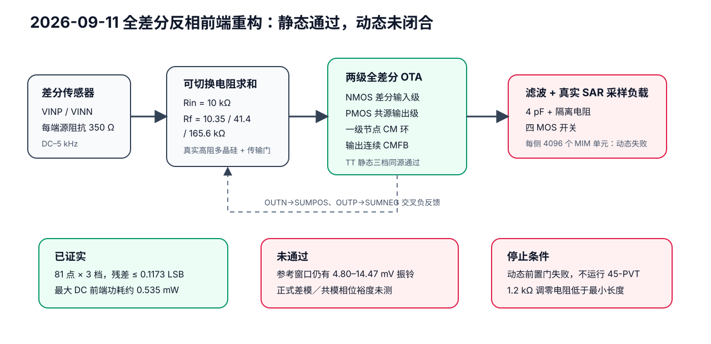

# 非 Cadence 前端重构（2026-09-11）

本目录是独立的新架构实验。它不修改或覆盖旧前端、`repair_20260910/` 或
`closure_20260911/` 的失败证据。目标是用真实 SKY130 器件完成同一套 1/4/16
倍可编程传感器前端，而不是把三个档位来自不同候选的结果拼在一起。

候选 01 改为全差分反相闭环：两条输入各经过真实高阻多晶硅电阻进入 OTA
求和节点，另一侧输出交叉反馈到同一节点。OTA 本体是两输入、两级、全差分
晶体管放大器；输出平均值由电阻连续检测，并由独立晶体管共模环调节。内部
没有理想电流源、理想受控放大器或理想开关。

所有候选与实验均须由 `run_diagnostic.py` 建立只增不改的时间戳目录并写入
源码快照、原始数据、日志、配置、结果和 SHA-256 manifest。12 次标称小诊断
全部用完之前，只允许在同一候选同时检查三档。三档静态、真实采样建立、差模
与共模稳定性以及功耗的前置门同时通过后，才允许一次 45-PVT DC 筛查。

## 当前候选与真实结果

- 当前源码：`candidate_01.spice`
- 当前源码 SHA-256：`2c36c23fb47036272a8dfe4a7fff6ee9101a9091fdcb1f13cb742880f257891e`
- 可复现汇总：`qualification.json`
- 选定冻结证据：`diagnostics/06_20260911T082721717297Z_candidate_01/`
- 真实采样开关：`sampling_switch.spice`

同一份候选源码在 TT／1.8 V／27 °C 完整跑完了三档各 81 个静态点。
用 −80%、0、+80% 三点拟合后，其余 78 个独立点的最大残差如下：

| 增益 | 最大静态残差 | 最大静态共模误差 | DC 前端最大功耗 | 关键管工作区 |
|---:|---:|---:|---:|---|
| 1 | 0.117264 LSB | 约 0.409 mV | 约 0.535 mW | 所列管均至少留 20 mV 饱和余量 |
| 4 | 0.015870 LSB | 约 0.409 mV | 约 0.526 mW | 同上 |
| 16 | 0.019776 LSB | 约 0.409 mV | 约 0.525 mW | 同上 |

这些是**同源静态通过**，不是完整前端通过。它说明反相全差分闭环消除了旧
FDDA 的大信号输入头间隙问题，并且新增的第一级共模环把一级节点稳定在约
0.705 V；它不能证明采样、噪声或稳定性合格。

## 为什么动态仍然失败

最后一次测试使用真实 LVT 主传输门、两个短接扩散假管和每侧 4096 个真实
MIM 单元。10 ns 数字边沿让仿真完成到 28.010 µs，随后在第三次复位边沿发生
`timestep too small`。在这之前完整记录的第一个采样周期已经足以否决动态门：

| 增益 | 第一个采集误差 | 16–19 µs 参考窗口峰峰值 | 结果 |
|---:|---:|---:|---|
| 1 | 约 70.55 µV | 约 14.47 mV | 失败 |
| 4 | 约 9.39 µV | 约 10.84 mV | 失败（参考未稳定） |
| 16 | 约 917.07 µV | 约 4.80 mV | 失败 |

采集误差门限是 48.828125 µV，安静参考窗口门限是 4.8828125 µV。三档参考
都还在毫伏级振铃，不能把 G4 的单个瞬时误差当成建立通过。差模和共模相位
裕度也没有完成正式注入测量，因此稳定性门明确为失败／未闭合。

按有界实验规则，本轮在第 6/12 次诊断后停止调参。由于三档动态和正式稳定性
前置条件没有同时通过，未启动 45-PVT DC 筛查，也未沿用旧候选的噪声数字。
当前文件出现不代表通过；最终状态以 `qualification.json` 为准。

## 物理可实现性审计

反馈网络没有出现毫米级电阻：0.35 µm 宽高阻多晶硅下，10 kΩ、10.35 kΩ、
41.4 kΩ、165.6 kΩ 的模型长度约为 9.10、9.46、40.72、165.80 µm；最大
单条反馈电阻的有效电阻体面积约 58.0 µm²，最终含触点、护环和走线会更大。
G1 时传感器看到的差分负载约 20.7 kΩ，±0.2 V 每条输入支路约 19.3 µA；
350 Ω 源阻抗造成的约 3.38% 压降已经包含在反馈阻值设计与静态校准内。

但本轮也发现一个不能掩盖的版图违规：两条 1.2 kΩ Miller 调零电阻按当前
0.35 µm 模型公式得到约 0.241 µm 长，低于 PDK PCell 的 0.5 µm 最小长度。
因为动态本来就失败，本轮没有偷偷把它四舍五入后继续宣称同一候选；物理可
布局门因此为失败。未来版本必须换更宽／更低阻的合法 PDK 电阻选项，或使用
最小合法尺寸，并从静态与动态重新验证。

## 文件怎么用

`run_diagnostic.py` 是可重跑入口；每次运行会生成新的时间戳证据目录，不覆盖
旧结果。`build_qualification.py` 只读取并校验第 6 次冻结证据，再重建汇总。
`test_evidence.py` 检查哈希、诊断次数和“静态通过不能掩盖动态失败”的真值。

这些结果全是开源 ngspice＋SKY130 模型的版图前结果；不是 Cadence 原生设计、
不是寄生后仿真、不是完整 ADC 转换结果，更不是流片或硅测。
