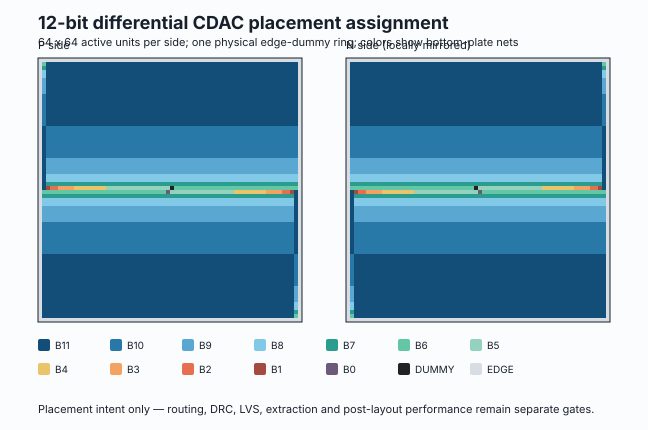

# 12-bit 差分 CDAC 物理分配

这里把 ADC 两侧共 **8192 个 3 µm × 3 µm MIM 单元**从电路权重转换成了可复现的二维放置输入。它不是最终版图，也没有把“排列正确”写成 DRC/LVS/PEX 通过。

## 已完成的这一层

- 每侧 64 × 64，共 4096 个有电连接的单位电容。
- `B11…B0 + DUMMY = 4096` 的数量由程序自动核对。
- `B11…B1` 中每一个电容都有关于阵列中心的同网络镜像伙伴，所以这些 bank 的几何重心严格落在阵列中心。
- 单独只有一个单元的 `B0` 和电气 `DUMMY` 放在中心附近的一对镜像位置；两者合起来共心。
- 外围增加一圈没有计入 4096 电气总数的 edge dummy，占位用于减轻边缘环境差异。
- N 侧相对 P 侧局部镜像，便于后续做差分对称顶层放置。

生成或复核：

    python3 v2/physical/cdac/generate_assignment.py
    python3 -m unittest v2/physical/cdac/test_assignment.py -v

机器可读结果在 `assignment_summary.json`；每个单位的网名、坐标和是否属于电气阵列记录在两个 CSV 中。

## 还不能声称什么

目前 4 µm pitch 是布线前估计。后续仍必须加入顶板、24 根 bit 底板、参考开关、屏蔽和电源，再用 SKY130 规则完成 DRC、LVS、寄生提取及性能回归。这里也没有凭几何排列推断空间梯度、失配、噪声或参考压降已经通过。
