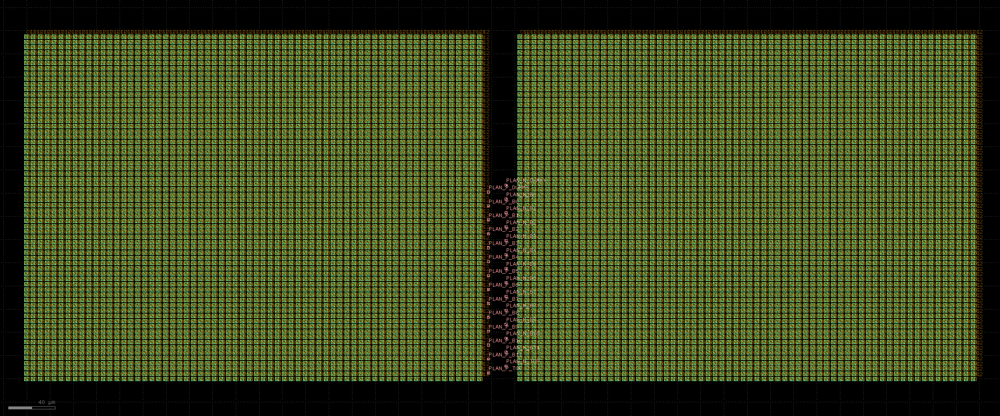
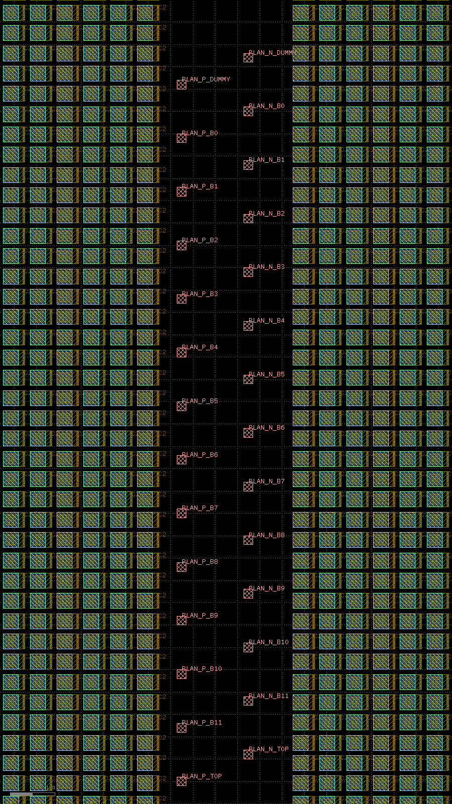

# 12-bit Differential CDAC: Floorplan with Placed Physical SKY130 Cells

## Conclusion

The original two-dimensional assignment table is now a hierarchical floorplan of real SKY130A MIM capacitors, openable in layout tools:

- Each P/N side places **4356** real `sky130_fd_pr__cap_mim_m3_1` cells;
- Each side contains **4096 active unit capacitors** and **260 edge dummies**;
- The top level therefore has **8712 physical MIM instances**, of which **8192 belong to the ADC's active arrays**;
- Magic reports **placement-only DRC=0** for the P side, N side, and differential top;
- Independent KLayout readback from the final GDS confirms two side cells at the top level and exactly 4356 MIM instances per side cell;
- A 30 µm central corridor is reserved for future routing, with 28 unconnected pin-planning markers clearly labeled `PLAN_*`.

This remains an **unrouted floorplan**. It is not final CDAC layout and does not establish passing LVS, PEX, or ADC post-layout simulation.



Pin-planning markers are tiny in the full view; the central corridor is enlarged below. Both P/N sides have `TOP`, `B11…B0`, and `DUMMY`. These pink squares are future routing landing points, not connected pins.



## Why the 4 µm pitch was not retained

The original 4 µm in the CSV was only an area estimate. A real 3 µm × 3 µm MIM PCell includes contacts and metal extensions, with an actual geometric bounding box of approximately **4.86 µm × 3.40 µm**. Considering only the “3 µm capacitor plate” therefore underestimates required spacing.

This round performed a two-cell boundary sweep using the real PCell, checking both conditions:

1. Magic DRC count must be 0;
2. The two extracted capacitor terminals must remain independent nodes, without accidental shorts from overlapping metal.

The second condition matters: at X pitch 4.8 µm, for example, DRC reports 0 but adjacent M3 already touches and extraction shows shorted terminals. Thus DRC=0 alone does not establish a usable pitch.

Final measured boundaries:

| Direction | Last failing point | First passing point / actual value used | Relative to original 4 µm |
|---|---:|---:|---:|
| X | 5.99 µm | **6.00 µm** | +50.0% |
| Y | 4.53 µm | **4.54 µm** | +13.5% |

The failing rule is `capm.11` in the SKY130 Magic deck: insufficient spacing between a MIM capacitor and unrelated M3. Complete probe results are retained under `pitch_qualification.all_probes` in `qualification.json`, together with raw logs and every two-cell extracted netlist.

## Area results

| Item | Current result |
|---|---:|
| Single-side array bounding box | 394.86 µm × 298.50 µm |
| Single-side bounding-box area | 117,865.71 µm² = 0.117866 mm² |
| Differential top bounding box, including 30 µm central corridor | 819.72 µm × 298.50 µm |
| Differential top bounding-box area | 244,686.42 µm² = 0.244686 mm² |
| Active capacitor-plate area of both sides | 73,728 µm² |
| Active plate area / both side bounding-box areas | 31.28% |
| Single-side area relative to old 264 µm × 264 µm estimate | +69.11% |

These are areas of the current P/N capacitor-array floorplan, not the complete chip core. Reference switches, comparator, frontend, biasing, and digital controller are not included.

## Key files

- `artifacts/cdac_diff_floorplan.gds`: differential top-level GDS openable in KLayout.
- `artifacts/cdac_diff_floorplan.mag`: Magic top level referencing two side cells.
- `artifacts/cdac_side_p.mag`, `artifacts/cdac_side_n.mag`: hierarchical Magic cells with 4356 instances per side.
- `artifacts/placement_index.csv`: maps every instance back to P/N, row/column, `B11…B0/DUMMY/EDGE`, and new coordinates.
- `artifacts/klayout_summary.json`: GDS readback hierarchy, instance counts, bounding boxes, and 28 planning markers.
- `qualification.json`: final machine-readable status, all checks, area, tool/PDK versions, hashes, and explicit limitations.
- `artifacts/magic_floorplan.log`: raw P/N/top placement-only DRC logs.
- `probe_artifacts/`, `probe_refine/`: two-cell MAG files, extracted netlists, and raw evidence generated by pitch sweeps.

## Reproduction

The project currently uses the fixed offline container `sky130-v2-resume-20260910`. Run from the repository root:

```bash
docker exec sky130-v2-resume-20260910 bash -lc \
  'python3 /repo/v2/physical/cdac_layout_20260911/qualify.py'
```

Starting from the original assignment CSV, the script reruns pitch probes, generates all 8712 instances, executes Magic placement-only DRC, reads the GDS back with KLayout, and generates two previews. On success, `qualification.json` status is `SKY130_CDAC_PLACEMENT_FLOORPLAN_PASS`.

## Unfinished requirements that cannot be omitted

- Connect all top plates on each side into a low-resistance, symmetric network;
- Connect every unit bottom plate to its corresponding `B11…B0/DUMMY` switch network;
- Place and connect reference switches, sampling switches, comparator, and reference supplies;
- Complete routed DRC;
- Perform LVS against an independent reference netlist;
- Extract parasitics and regress reference droop, settling time, linearity, noise, and dynamic accuracy;
- Verify the top level after integrating the frontend, bias, and digital controller;
- Complete final native Cadence layout and the school-rule closed loop.

This directory therefore completes a real, reviewable **physical placement milestone**, not final physical sign-off of the CDAC or complete ADC.
