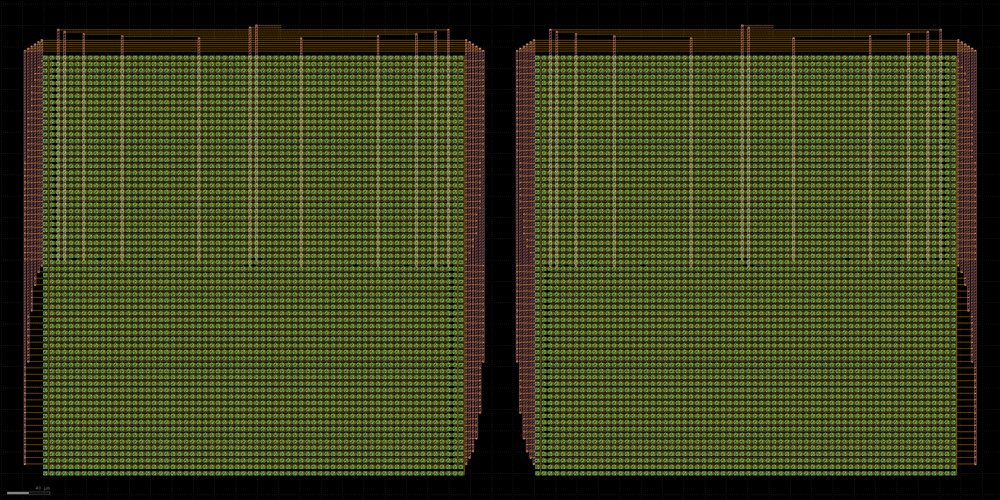
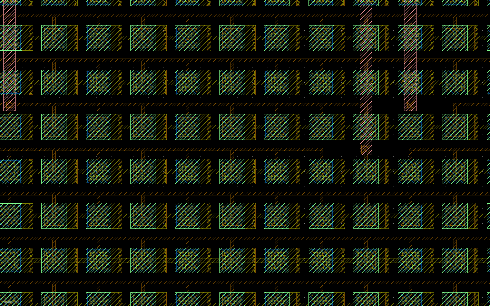

# 12-bit 差分 CDAC：SKY130 真实布线、DRC/LVS 与 RC 提取

## 结论

本目录把此前只有真实电容放置、尚未接线的 CDAC floorplan，推进成了一个**有真实金属连线的独立无源差分 CDAC 宏单元**：

- P、N 两侧各有 4096 个有效单位电容和 260 个边缘 dummy；顶层共有 **8192 个有效 MIM**、**520 个边缘 MIM**，合计 **8712 个真实 SKY130 MIM 实例**。
- 原 64 × 64 电气分配没有改变；每侧仍严格满足 `B11…B0 = 2048…1`，另有一个 electrical `DUMMY`。
- 每侧 `TOP`、`B11…B0`、`DUMMY`、`EDGE_BIAS` 共 15 个物理端口均已接通；差分顶层有 30 个端口。
- P 侧、N 侧及差分顶层 Magic DRC 均为 0。
- 代表 tile、P 侧、N 侧和差分顶层均与独立参考网表 **Netgen 唯一匹配**。
- 完整差分顶层已经做展平 RC 提取，保留 8712 个 MIM，并产生 26,210 段互连电阻和 17,710 个提取电容项。

机器可读的最终状态为 `SKY130_CDAC_ROUTED_OPEN_PDK_PASS`，见 [`qualification.json`](qualification.json)。这个 PASS 只适用于本目录的**无源 CDAC 宏单元**，不代表完整 SAR ADC、前端或全芯片通过，也不是 Cadence／foundry signoff。

下面两张是展示专用图片。为避免端口名和每个 MIM 内部文字压住器件或导线，渲染脚本只在内存副本中隐藏了全部 GDS text；它**没有改写 GDS**。带完整标签的原始证据图仍保存在 `artifacts/cdac_diff_routed.png` 和 `artifacts/cdac_routing_detail.png`。



下面是中心 B0／DUMMY 区域的近景。可以分辨单个 MIM、电容端子上的 M4 escape、行间 M4 导线、via4 落点和竖直 M5 trunk；图上没有文字覆盖金属。



## 真实连接方式

每个有效电容都有两个端子：

1. `C2` 端通过与端子实际重叠的 M3 横线接到每一行的 TOP rail，再由一根 M3 竖线把 64 行接成同一个 `TOP` 网络。
2. `C1` 端先用 M4 finger 进入相邻行间走线通道；同一行内连续且属于同一 bit 的电容由 M4 row bus 汇合。
3. 每条 row bus 通过真实 `via4` 接到 M5 trunk。每侧共有 24 根 M5 trunk；同一 bit 的多根 trunk 再由阵列上方、彼此分开的 M4 peripheral bus 实际连接。
4. 每条 peripheral bus 都延伸到真正的引脚落点后才放置端口 label。label 只给已经存在的导体命名，从未跨空白代替金属。
5. 外围 260 个 edge dummy 的两端局部短接，并接入单独的 M3 `EDGE_BIAS` ring；它们不会错误地给 `TOP` 增加 260 个单位电容。以后集成时，`EDGE_BIAS` 必须接到安静、固定的偏置。

原来的 x 坐标和各 bit 的共心分配保持不变。为了让 1.18 µm 的 via4 landing、1.60 µm 宽 M5 和行间 M4 routing 满足间距规则，y pitch 从 4.54 µm 增加到 6.00 µm；增幅为 32.1586%。

## 为什么这不是“同名标签造成的假连接”

本轮用了四层相互独立的证据：

- 小型 4-MIM 代表 tile 先验证 M3/M4/via4/M5 的端口访问方式，DRC=0、LVS 唯一匹配，并在新 Magic 进程中提取出真实 R/C 网络。
- 完整版图提取网表逐个保留 4356 个 MIM／侧。审计脚本直接把每个 MIM 的两个提取端子与冻结的原始 assignment CSV 比较，而不是只相信汇总数字或同一个生成器的声明。
- P、N 两侧各只出现 15 个网络，差分顶层只出现预期的 30 个端口；所有原始网表中的 bit 权重、TOP 和 EDGE_BIAS 连接均与参考一致。若一段导线断开并产生额外节点，这些直接比对会失败。
- KLayout 独立回读最终 GDS，确认顶层恰有两个 side cell、每侧恰有 4356 个 MIM，并读到全部 30 个顶层物理端口 label。

Netgen 日志会说明 MIM 模型作为两端 black box 比较；因此 LVS 结论是**实例类型、数量、引脚和网络拓扑匹配**。实际 MIM 几何来自已验证的 SKY130 PCell，且由 Magic DRC 和 KLayout GDS 回读另行约束。Netgen 在报告中把同网络并联的 4356 个 MIM 合并成 14 组只是比较优化；原始提取网表和 CSV 审计仍逐个检查全部实例。

## 核心证据

| 对象 | MIM 数 | 端口／网络数 | Magic DRC | 独立 LVS | RC 提取 |
|---|---:|---:|---:|---|---|
| 代表 tile | 4 | 3 | 0 | 唯一匹配 | 9 R、11 C |
| P 侧 | 4356 | 15 | 0 | 唯一匹配 | 13,105 R、8,855 C |
| N 侧 | 4356 | 15 | 0 | 唯一匹配 | 13,105 R、8,855 C |
| 差分顶层 | 8712 | 30 个端口 | 0 | 唯一匹配 | 26,210 R、17,710 C |

最终 `.res.ext` 全部非空：代表 tile 1168 bytes，P 侧 1,608,389 bytes，N 侧 1,607,456 bytes，差分顶层 3,433,086 bytes。这里列出的 R/C 数量证明提取网络真实存在；电阻总和或电容项总和并不是某一条端到端路径的等效值，不能直接当作建立时间或 INL 结论。

## 面积与布线资源

| 项目 | 结果 |
|---|---:|
| routed pitch | x = 6.00 µm，y = 6.00 µm |
| 单侧读回外框 | 431.60 µm × 422.50 µm |
| 差分顶层读回外框 | 893.20 µm × 422.50 µm |
| 差分顶层宏面积 | 377,377 µm² = **0.377377 mm²** |
| 每侧 contiguous row runs | 140 |
| 每侧 M5 trunks | 24 |

使用的物理资源为 M3 TOP mesh、M4 C1 escape／row bus／peripheral bus、真实 via4 和 M5 trunk。面积只属于当前差分无源 CDAC；参考开关、采样开关、比较器、参考缓冲、数字控制和前端均未计入。

## `.res.ext` 早期为什么为空

第一次代表 tile 尝试在“建立层次版图的同一个 Magic 进程”里紧接着执行 `extresist all`。该进程保留了错误的层次 extraction root，因而找不到展平父 cell 的 `.ext`，没有生成电阻网络。失败输出完整保存在 `probe_artifacts/attempt_in_process_extresist_root_failure.log`。

修正不是伪造空文件或降低条件，而是把 RC 提取放入全新的 Magic 进程，并让一次进程只处理一个明确 root。`extract_probe_rc.tcl`、`extract_rc.tcl` 和 `extract_top_rc.tcl` 均采用这一边界；最终四份 `.res.ext` 都非空，SPICE 中也有正值 R/C。

## 保留的失败记录

| 失败 | 证据 | 修正 |
|---|---|---|
| 首版内部宽 M3 trunk 违反 `capm.11`，每侧 194 项 | `artifacts/attempt1_capm11_194_per_side.log` | TOP joining 移到已验证的边界 slot，竖直 M3 缩为 0.30 µm |
| 第二次运行加载旧 `.mag`，旧图形累积，仍有 194 项 | `artifacts/attempt2_stale_mag_replayed_194_per_side.log` | 生成前只删除本生成器命名的 cell，再完整重建 |
| DRC=0 但 B0／DUMMY 未成为端口 | `artifacts/attempt3_drc0_missing_b0_dummy_ports.log` | 每条 peripheral bus 实际延伸到统一 pin x |
| side 已正确，但顶层只提取出两个端口 | `artifacts/attempt4_drc0_side_lvs_ready_top_ports_missing.log` | 每个顶层 label 下增加 parent-level M3/M4 landing |
| 同进程 RC 提取没有电阻网络 | `probe_artifacts/attempt_in_process_extresist_root_failure.log` | 新 Magic 进程中对明确的 flattened root 执行提取 |

## 关键文件与访问方法

- `artifacts/cdac_diff_routed.gds`：最终差分 routed GDS；用 KLayout 打开。
- `artifacts/cdac_diff_routed.mag`：Magic 顶层；同目录包含两个 side cell 和 `mim_unit.mag`。
- `artifacts/cdac_side_p_routed.gds`、`artifacts/cdac_side_n_routed.gds`：独立 P／N 宏。
- `artifacts/cdac_diff_routed_flat_rc.spice`：完整差分 flattened RC PEX 网表。
- `artifacts/cdac_diff_routed_flat_rc.res.ext`：完整差分 Magic 电阻提取中间证据。
- `artifacts/top_lvs.rpt`、`artifacts/side_p_lvs.rpt`、`artifacts/side_n_lvs.rpt`：原始 LVS 报告。
- `artifacts/magic_full.log`：P、N 和顶层 DRC 原始日志。
- `artifacts/klayout_readback.json`：独立 GDS 层次、实例和端口回读。
- `qualification.json`：最终机器审计、所有 checks、限制、面积和关键文件哈希。
- `probe_artifacts/`：先行代表 tile 的 MAG/GDS/LVS/PEX 与失败证据。

不安装任何 EDA 工具也可以直接打开本 README 中两张 PNG、`qualification.json` 和 LVS 报告查看结果。要交互查看几何，可在 KLayout 中打开 `artifacts/cdac_diff_routed.gds`；要看电气连接，可用文本编辑器或 SPICE 工具打开 PEX 网表。

## 复现与测试

物理工具使用固定离线容器 `sky130-v2-resume-20260910`，PDK 为 `/foss/pdks/sky130A`。下面的命令须从仓库根目录运行，所有物理工具按顺序执行，避免多个进程同时改同一组 cell：

```bash
# 1. 从冻结 CSV 生成真实布线 Tcl 与独立参考网表
python3 v2/physical/cdac_route_20260911/generate_routed_cdac.py

# 2. 先跑代表 tile，然后独立进行其 RC 提取
docker exec sky130-v2-resume-20260910 bash -lc \
  'magic -dnull -noconsole -rcfile /foss/pdks/sky130A/libs.tech/magic/sky130A.magicrc /repo/v2/physical/cdac_route_20260911/probe_routes.tcl > /repo/v2/physical/cdac_route_20260911/probe_artifacts/magic.log 2>&1'
docker exec sky130-v2-resume-20260910 bash -lc \
  'cd /repo/v2/physical/cdac_route_20260911/probe_artifacts && netgen -batch lvs "cdac_route_probe_flat.lvs.spice cdac_route_probe_flat" "reference.spice cdac_route_probe_flat" /foss/pdks/sky130A/libs.tech/netgen/sky130A_setup.tcl lvs.rpt -json > netgen.log 2>&1'
docker exec sky130-v2-resume-20260910 bash -lc \
  'magic -dnull -noconsole -rcfile /foss/pdks/sky130A/libs.tech/magic/sky130A.magicrc /repo/v2/physical/cdac_route_20260911/extract_probe_rc.tcl > /repo/v2/physical/cdac_route_20260911/probe_artifacts/rc_extraction.log 2>&1'

# 3. 生成完整 P/N/顶层版图并运行 Magic DRC/提取
docker exec sky130-v2-resume-20260910 bash -lc \
  'magic -dnull -noconsole -rcfile /foss/pdks/sky130A/libs.tech/magic/sky130A.magicrc /repo/v2/physical/cdac_route_20260911/artifacts/generate_routed_cdac.tcl > /repo/v2/physical/cdac_route_20260911/artifacts/magic_full.log 2>&1'

# 4. 在 artifacts/ 内分别运行 P、N 与顶层 Netgen LVS
docker exec sky130-v2-resume-20260910 bash -lc \
  'cd /repo/v2/physical/cdac_route_20260911/artifacts && netgen -batch lvs "cdac_side_p_routed_flat.lvs.spice cdac_side_p_routed_flat" "cdac_side_p_routed_flat.reference.spice cdac_side_p_routed_flat" /foss/pdks/sky130A/libs.tech/netgen/sky130A_setup.tcl side_p_lvs.rpt -json > side_p_netgen.log 2>&1'
docker exec sky130-v2-resume-20260910 bash -lc \
  'cd /repo/v2/physical/cdac_route_20260911/artifacts && netgen -batch lvs "cdac_side_n_routed_flat.lvs.spice cdac_side_n_routed_flat" "cdac_side_n_routed_flat.reference.spice cdac_side_n_routed_flat" /foss/pdks/sky130A/libs.tech/netgen/sky130A_setup.tcl side_n_lvs.rpt -json > side_n_netgen.log 2>&1'
docker exec sky130-v2-resume-20260910 bash -lc \
  'cd /repo/v2/physical/cdac_route_20260911/artifacts && netgen -batch lvs "cdac_diff_routed.lvs.spice cdac_diff_routed" "cdac_diff_routed.reference.spice cdac_diff_routed" /foss/pdks/sky130A/libs.tech/netgen/sky130A_setup.tcl top_lvs.rpt -json > top_netgen.log 2>&1'

# 5. 在分开的新 Magic 进程中进行 side 和差分顶层 RC 提取
docker exec sky130-v2-resume-20260910 bash -lc \
  'magic -dnull -noconsole -rcfile /foss/pdks/sky130A/libs.tech/magic/sky130A.magicrc /repo/v2/physical/cdac_route_20260911/extract_rc.tcl > /repo/v2/physical/cdac_route_20260911/artifacts/rc_extraction.log 2>&1'
docker exec sky130-v2-resume-20260910 bash -lc \
  'magic -dnull -noconsole -rcfile /foss/pdks/sky130A/libs.tech/magic/sky130A.magicrc /repo/v2/physical/cdac_route_20260911/extract_top_rc.tcl > /repo/v2/physical/cdac_route_20260911/artifacts/top_rc_extraction.log 2>&1'

# 6. KLayout 独立回读并输出证据图和无标签展示图
docker exec sky130-v2-resume-20260910 bash -lc \
  'cd /repo/v2/physical/cdac_route_20260911 && python3 render_klayout.py > artifacts/klayout_render.log 2>&1'

# 7. 不重跑物理工具，审计全部已有证据并执行回归测试
python3 v2/physical/cdac_route_20260911/qualify.py
python3 -m unittest v2/physical/cdac_route_20260911/test_routed_cdac.py -v
```

`qualify.py` 不会根据文件是否“存在”就判定通过；它会解析 DRC/LVS、端口、原始 MIM 端子、CSV 数量、RC 元件、`.res.ext`、GDS 回读、PNG 尺寸和关键文件哈希。

## 尚未完成，不能从本目录宣称

- 没有集成 reference-selection switch、采样开关、比较器、参考分配／缓冲、数字 SAR 控制、前端或偏置。
- 没有用这份 RC PEX 完成 reference droop、settling、INL/DNL、噪声、SNDR 或全 ADC 后版图仿真。
- 没有做 EM/IR、antenna、density/fill、耦合 corner 或可靠性 signoff。
- 没有使用 Cadence，也没有替代未来学校 Cadence/验证规则的闭环。

因此，本目录完成的是新版项目里一个可独立复核、可实际集成的**差分无源 CDAC 物理宏**，不是完整 ADC，更不是已经完成的芯片。
