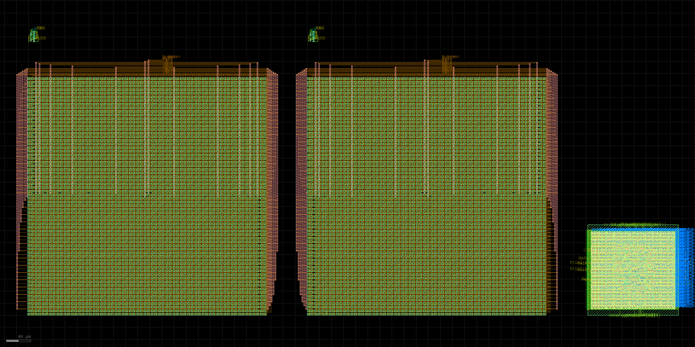

# Local Preparation for Core Layout and Top-level Post-layout Simulation (2026-09-13)

Layouts of the three existing real macro types were placed into one openable GDS, with source evidence, ports, and post-extraction views checked. **This is an unrouted partial assembly, not a complete core layout; top-level LVS, PEX, and performance post-layout simulation have not been performed.**

This round adds files only in this directory. Legacy modules, existing pass/fail evidence, and the school Cadence project were not changed.

## Work actually completed

| Artifact or check | This round's result and boundary |
|---|---|
| Existing macro-evidence review | 148 checks pass, covering frozen hashes, raw DRC/LVS logs, RC elements, port order, and 8712 MIMs |
| Real macro-assembly GDS | 1 differential CDAC, 2 four-transistor sampling switches, 1 digital controller macro; 4 top-level instances, no fake placeholder modules |
| Independent KLayout readback | Instance-count and nonoverlap checks pass; actual pin coordinates and layer numbers exported |
| Magic assembly-geometry check | Reimported from the new GDS; raw output `Total DRC errors found: 0`, valid only for the current unrouted assembly |
| Partial electrical-connection fixture | Real CDAC RC plus two real four-transistor switch RC views; all bottom-plate ports and clock/reference interfaces explicitly retained |
| Top-level post-layout readiness gate | Correctly returns `BLOCKED_FULL_CORE_POSTLAYOUT` (exit code 2), without treating passing macros or geometry DRC=0 as a passing chip |
| False-pass-prevention checks | 7 tests pass, covering stale hashes, unextracted netlists, swapped A/B, missing modules, substrate binding, and the 135-point matrix |

Assembly bounding box is **1093.2 × 469.795 µm**. It contains only these macros and provisional spacing; future analog modules and reference/clock routing are excluded, so it cannot report final core area.



## Two findings affecting post-layout simulation correctness

**The extracted CDAC netlist originally kept `VSUBS` as an internal node, outside its 30 ports.** Direct SPICE instantiation leaves a local substrate node that external VSS cannot constrain. This directory generates `cdac_diff_routed_substrate_bound.spice`, changing only the subcircuit name and appending a `VSUBS` port; every capacitor, resistor, and MIM instance line remains verbatim. The local fixture connects this new port to VSS. The original extraction remains unchanged; this is a simulation adapter making the substrate boundary explicit, not a new PEX run.

The old CDAC summary also used a regular expression recognizing only the `f` suffix, recording 17,710 capacitors. Independent review finds **17,732 C entries in the original netlist: 17,730 positive and 2 zero-valued**; 20 additional positive entries use the `p` suffix. All 26,210 R entries and 8712 MIMs are retained. This corrects the count description without changing the old report or inferring accuracy from component counts.

**Digital-macro SPICE is an LVS topology view, with R=0, C=0, and abstract empty subcircuits.** The macro does have verified SPEF, SDF, gate-level netlists, and STA, but this SPICE cannot directly serve as complete transistor RC post-layout simulation. The binding table explicitly distinguishes these views. Ultimately a qualified gate-level timing/analog-level interface co-simulation, or a separate complete transistor RC extraction, is required.

Sampling-switch A/B are directional: this fixture connects A to `VCM_CLAMP` and B to the held P/N top plates. It does not claim that old independent input-sampling tests cover actual bottom-plate switching or top-plate clamp behavior. Ten intermediate files listed in the switch's original physical report are absent from portable artifacts; this report lists them without treating missing intermediate files as hash passes. Hashes of existing final GDS, RC, MAG, LVS reports, and layout logs were actually checked.

## File entry points

- `macro_evidence_audit.json`: 148 evidence checks, raw/positive RC counts, and unretained intermediate-file list.
- `reusable_macros_UNROUTED.gds`: real partial assembly; top cell `REUSABLE_MACROS_UNROUTED_20260913`.
- `assembly_readback.json`: instances, bounding box, pin coordinates, layer numbers, and no-top-level-routing status.
- `assembly_drc.log` / `assembly_geometry_validation.json`: raw output and hash binding for this round's Magic geometry check.
- `extracted_view_bindings.json`: frozen GDS/netlist/SPEF/SDF, ports, and hashes; missing views explicitly null.
- `cdac_clamp_pex_partial.spice`: partial subcircuit for constructing the next-stage testbench, **not a standalone runnable simulation bench**; requires public PDK models, external references, bottom-plate drivers, real clocks, and stimulus under the project environment.
- `postlayout_acceptance_matrix.json`: G1/G4/G16 × 5 processes × 3 supplies × 3 temperatures, 135 base conditions, all `NOT_RUN`.
- `postlayout_readiness.json`: explicit blockers for complete-core post-layout simulation.

The matrix reads thresholds from `v2/config/spec.json`: 100 kS/s, 12 bit, 0.8 Vpp, nominal/corner SNDR ≥65/62 dB, power ≤2/3 mW, settling error ≤0.25 LSB, static-calibration residual ≤1/4 LSB, INL ≤1.5 LSB, DNL −0.9 to +1.5 LSB, and phase margin ≥60°. A 16,384-point spectrum and at least 200 system mismatch samples remain separate requirements. 135 is the base PVT row count, excluding extensions for common-mode/source-impedance sensitivity, multiple frequencies, mismatch samples, and calibration sampling; 200 samples are not reinterpreted as 200 repeats at every PVT point.

The gate checks only **whether the inputs needed to start full post-layout simulation are complete**. Even a future `READY_FOR_FULL_CORE_POSTLAYOUT_SIMULATION` result will not give chip-performance PASS; the matrix must actually run, followed by review of raw waveforms, noise methods, statistics, and complete-cycle power.

## Minimum inputs needed to continue

1. Freeze one frontend revision after formal multiloop stability, noise, and PVT completion; a dynamic candidate exists, but layout sign-off cannot be frozen early.
2. Real layouts and corresponding schematics for frontend, comparator/preamplifier, reference selection/distribution, nonoverlapping phases, and actual drivers. These macros are absent from the current physical directory.
3. Freeze the tracking/fixed reference contract and complete joint conversion acceptance for real clock loading and sampling/clamping/bottom-plate interfaces.
4. Connect all macros, supplies, and substrates using frozen interfaces, then run **complete-core** DRC/LVS/PEX; macro parasitics exclude future intermacro wires.
5. Bind the complete-core extracted views to all three gain conditions and complete continuous conversion, all-code, long-record noise-inclusive spectra, mismatch, settling, and power acceptance. Existing nine-corner digital STA cannot replace analog 45-PVT.

Local open-source tools can continue these steps; no new accounts or restricted PDK are needed for this preparation. Migration to school Cadence and school-process-rule sign-off form a later independent closed loop.

## Reproduction

From the repository root:

```sh
python3 v2/physical/core_integration_20260913/prepare.py
python3 v2/physical/core_integration_20260913/test_preparation.py
python3 v2/physical/core_integration_20260913/postlayout_gate.py
```

The third command should currently return exit code **2**, indicating actually unmet prerequisites; ignoring the exit code must not be used to call it a pass.

Physical assembly and geometry review use the existing offline container:

```sh
docker exec sky130-v2-resume-20260910 python3 /repo/v2/physical/core_integration_20260913/assemble_gds.py
docker exec sky130-v2-resume-20260910 bash -lc 'magic -dnull -noconsole -rcfile /foss/pdks/sky130A/libs.tech/magic/sky130A.magicrc /repo/v2/physical/core_integration_20260913/check_assembly_drc.tcl > /repo/v2/physical/core_integration_20260913/assembly_drc.log 2>&1'
```

These steps did not run new transistor transient simulations, perform complete-core LVS/PEX, or operate Cadence.
