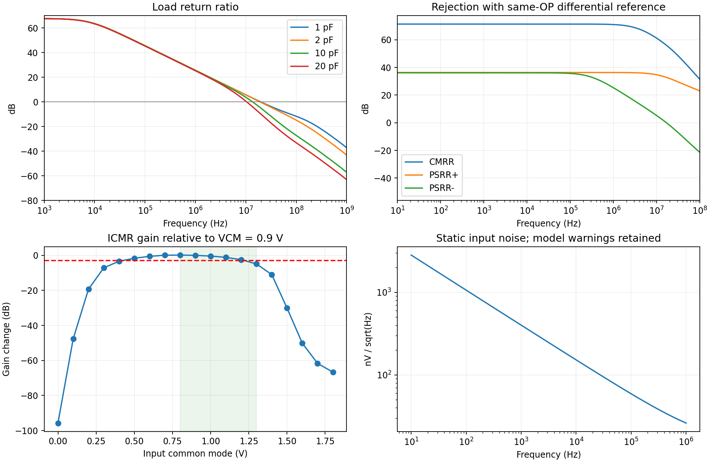

# Legacy OTA: Reproduction Report for 32 Corresponding Local Tests

**All 32/32 corresponding local ngspice tests were actually executed and exported; performance failures exist. The 32 school Cadence items still require returned raw results and cannot be marked complete on this basis.**

Uses the 13 MOS dimensions and diffusion geometries already exported by the school, retaining 3 pF / 2 kΩ compensation, 100 kΩ loading, and ideal external 10 µA bias. The legacy circuit and historical results are unchanged. One nominal differential comparison and one same-bias differential reference were also run, for 34 valid simulations total.

## Results

| Item | Local result | Assessment |
|---|---:|---|
| CMRR @ 1 kHz | 71.3239 dB | PASS; threshold 55 dB |
| PSRR+ @ 1 kHz | 36.3307 dB | FAIL; threshold 45 dB |
| PSRR- @ 1 kHz | 36.0995 dB | FAIL; threshold 45 dB |
| Input common-mode range | On a 0.1 V grid: 0.8–1.2 V | FAIL; does not cover 1.3 V |
| Input noise at 1 kHz | 401.152 nV/√Hz | Report-only; no hard threshold |
| Input noise from 10 Hz to 1 MHz | 52.300 µV RMS | Report-only; model warnings retained |

| Load | Phase margin | Worst settling time | Loop/step |
|---|---:|---:|---|
| 1 pF | 93.784° | 51.677 ns | PASS / PASS |
| 2 pF | 85.928° | 48.689 ns | PASS / PASS |
| 10 pF | 53.767° | 140.501 ns | FAIL / PASS |
| 20 pF | 40.554° | 249.532 ns | FAIL / PASS |

10/20 pF are extended characterization beyond the original required 1/2/5 pF load matrix. Their loops do not reach 55°; even if steps eventually settle, a step PASS cannot override a phase-margin failure.

The common-mode sweep automatic per-item criterion checks only absolute gain ≥50 dB; ICMR additionally requires no more than 3 dB decrease relative to 0.9 V. Thus the automatic status of icmr_13 is PASS but its gain change is -4.908 dB, so it cannot count as an ICMR pass. Range endpoints have only 0.1 V grid resolution; no continuous boundary is claimed.

The DC follower sweep completed, but it also moves input common mode and lacks per-point operating-region checks and a reverse sweep. It cannot replace independent output-swing acceptance in the frozen specification.



## Reproduction Consistency and Corrected Local Checking Issues

Nominal differential gain differs from school data by -0.000010883 dB; power differs by 0.000018166 µW. This compares the nominal circuit and tools; it is not a new-frontend metric.

The first smoke run used type-normalized positive values for raw BSIM PMOS operating points, whereas the reused school analyzer expects signed D−S / G−S values, causing a false operating-region failure. That experiment is fully retained. Formal runs change only the PMOS id/vgs/vds/vdsat signs in the export adapter; raw op.tsv is unchanged. All formal jobs use the same core-netlist hash.

CM/PSRR tests have output DC around 0.929 V, versus approximately 0.900 V in the original nominal servo differential test. This round adds a differential reference with identical DC bias, changing only AC stimulus. Nodes and frequency axes are checked before computing Ad/Acm or Ad/Aps; supply transfer response is not directly treated as a rejection ratio.

Ordinary noise returns amplitude spectral density; this report integrates its square and then takes the square root, following the [Official ngspice noise-analysis documentation](https://nmg.gitlab.io/ngspice-manual/analysesandoutputcontrol_batchmode/analyses/noise_noiseanalysis.html). The noise record has 26 source/drain conductance reset warnings, all retained; no claim of zero warnings, passing switched-noise qualification, or passing ADC SNDR is made.

## Reproduction Entry Points

Execute in `/repo` in the configured local EDA container:

```sh
python3 v2/verification/legacy_extra_20260913/run_campaign.py
python3 v2/verification/legacy_extra_20260913/run_rejection_reference.py
```

Both commands create new timestamped directories. Pass their output directories to `build_report.py --campaign ... --reference ...`, which checks raw-file hashes before generating a new report. These scripts depend on local ngspice/NumPy and are not an upload package for direct execution under school Python 3.6.8.

This report verified 660 source/result file entries; see [Machine-readable review](review.json) and [32-item details](jobs32.csv) for the complete listing. Model-entry and recursive include-content hashes, source snapshots, netlists, all operating points, curves, logs, and exit codes are stored in the corresponding run directories.

The school side continues using the verified existing extra entry point. This round did not overwrite the school OA library or generate a legacy OTA package requiring reimport. The three existing PVT settling failures remain; the legacy OTA overall specification-compliance status is unchanged.
